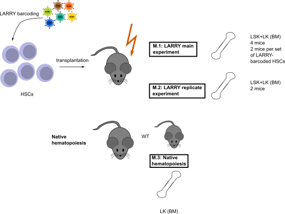

## Experimental design

This vignette describes how to generat the plots for Figure 1 of the EPI-Clone manuscript. Specically, it shows how the three experiments analysing HSPCs (M.1: LARRY main experiment, M.2: LARRY replicate experiment, M.3: Native hematopoiesis) analysed together provide a high-resolution, DNA-methylation-based UMAP of murine hematopoiesis.



```{r setup, include=FALSE}
library(Seurat)
library(ggplot2)
library(viridis)
library(gridExtra)
library(corrplot)
library(harmony)
library(infotheo)
library(caret)
library(randomForest)
library(ComplexHeatmap)
library(uwot)
knitr::opts_chunk$set(echo = TRUE)
plot_theme_legend <- theme(panel.background = element_rect(color='black',fill='white'),
                          panel.grid=element_blank(),
                          text=element_text(color='black',size=10),
                          axis.text=element_text(color='black',size=10),
                          axis.ticks=element_line(color='black', size=.1),
                          strip.background = element_blank(),
                          legend.key=element_rect(color='black', fill=NA),
                          legend.key.size = unit(5, 'mm'),
                          strip.text = element_text(color='black',size=12))
plot_theme_title <- theme(panel.background = element_blank(),
                    panel.grid=element_blank(),
                    text=element_text(color='black',size=10),
                    axis.text=element_blank(),
                    axis.ticks=element_blank(),
                    axis.title=element_blank(),
                    strip.background = element_blank(),
                    legend.key=element_rect(color='black', fill=NA),
                    legend.key.size = unit(5, 'mm'),
                    legend.position = 'none',
                    strip.text = element_text(color='black',size=12),
                    plot.title = element_text(color='black',size=10))
plot_theme <- theme(panel.background = element_rect(color='black',fill='white'),
                    panel.grid=element_blank(),
                    text=element_text(color='black',size=12),
                    axis.text=element_text(color='black',size=10),
                    axis.ticks=element_line(color='black', size=.1),
                    strip.background = element_blank(),
                    legend.key=element_rect(color='black', fill=NA),
                    legend.key.size = unit(5, 'mm'),
                    plot.title=element_blank(),
                    legend.position = 'none',
                    strip.text = element_text(color='black',size=12))
color_map <- c("HSC/MPP1"="maroon4",
  "MPP2" ="darkgrey",
  "MPP3" = "darkblue",
  "MPP4" = "darkgreen",
  "pre/pro-B" ="#94B1F9",
  "GMP" = "#C3C380",
  'Myeloid Progenitors'="#C3C380",
  'Myelocytes'='#e5e500',
  "MEP"="#D5392C",
  "EryP" = "#ED7950",
  "MkP 1" = "#BDA8CB",
  "MkP" = "#BDA8CB",
  "MkP 2" = "#D36494"
  )
source('../../scripts/helper_functions.R')
source('../..//scripts/EPIClone.R')
```

This vignette shows some applications of EPI-clone in combination with the DNA methylation readout provided by scTAM-seq.

## Write amplicon csv

```{r panel}
panel <- read.table('../../infos/panel_info_dropout_pwm.tsv')
to_write <- panel[panel$DropoutUncutLKs>0.9, 'Type']
to_write <- to_write[to_write%in%c('HSC_high', 'MPP_high', 'MPPI_high', 'MPPII_high', 'WSH', 'IMR')]
to_write[to_write%in%c('HSC_high', 'MPP_high', 'MPPI_high', 'MPPII_high')] <- 'DMC'
```

## Differentiation uMAP (Figure 1c)

We simply load the data and visualize the integrated uMAP that shows three differentiation trajectories.

```{r differentiation_umap, warning=F, message=F}
seurat_obj <- readRDS(url('https://figshare.com/ndownloader/files/42479346'))
DimPlot(seurat_obj, group.by = "CellType",reduction="umap") + ggtitle("") + NoAxes() + NoLegend() + scale_color_manual(values = color_map)
```

## Cell type annotation with bulk profiles

To annotate the different clusters we identified, we leverage information from bulk data. Using this information, we can compute a relative methylation score for a subset of amplicons in each of the cells.

```{r bulk_methylation, fig.width=4,fig.height=4}
panel_file <- '../../infos/panel_info_dropout_pwm.tsv'
counts <- as.matrix(GetAssayData(seurat_obj,
                       'DNAm',
                       slot='counts'))
plot_hsc <- plot_type_methylation(seurat_obj,
                                  t(counts),
                                  type='HSC_high',
                                  panel = panel_file)+
  plot_theme_title#+ggtitle('HSC high')
plot_mpp <- plot_type_methylation(seurat_obj,
                                  t(counts),
                                  type='MPP_high',
                                  panel = panel_file)+
  plot_theme_title#+ggtitle('MPP3/4 high')
grid.arrange(plot_hsc,
             plot_mpp,
             nrow=1)
```

## Surface protein expression per cell type (Figure 1f)

In a first step, we only use data, where antibody staining was performed and remove cells from plotting that do not express any surface antibodies or where there is another potential issue with the antibody staining (unusually high expression of all surface markers).

```{r subset_data, message=FALSE, warning=FALSE}
seurat_ab <- subset(seurat_obj,
                    ProcessingBatch%in%c('LK_LSK_stained', 'LARRY_mouse3', 'LARRY_mouse4'))
```

We use CLR normalization, which is typically used for normalization of surface marker expression data.

```{r normalize_the_data, echo = F}
seurat_ab <- NormalizeData(seurat_ab,
                           assay = 'AB',
                           normalization.method = 'CLR')
adt_data <- t(as.matrix(GetAssayData(seurat_ab,
                         assay='AB',
                         slot = 'data')))
all_zeros <- apply(adt_data, 1, function(x)all(is.na(x), na.rm=TRUE))
adt_data[all_zeros, ] <- 0
all_zeros <- all_zeros|apply(adt_data, 1, function(x)all(x>1, na.rm = TRUE))
seurat_ab <- seurat_ab[, !all_zeros]
adt_data[is.na(adt_data)] <- 0
plot_dat <- data.frame(seurat_ab[[]], adt_data[!all_zeros, ])
```

For plotting purposes, we only use the surface markers, SCA-1, cKIT, CD48, CD150, CD135 and CD201, which are commonly used for sorting different HSPC (HSC and MPP) populations.

```{r plot_ab_data the data, echo = F}
sca1_gate <- 2
ckit_gate <- 1
extension <- '.raw'
abs <- c('SCA1',
         'cKIT')
to_plot <- data.frame(plot_dat[, c(paste0(abs, extension),'CellType')])
colnames(to_plot)[1:2] <-abs
plot1 <- ggplot(to_plot, aes_string(x='SCA1', y='cKIT', color='CellType'))+
  geom_point(size=.5, stroke=.5)+
  geom_vline(xintercept = sca1_gate)+geom_hline(yintercept = ckit_gate)+
  plot_theme+scale_color_manual(values=color_map)

plot_dat <- plot_dat[which(plot_dat[, paste0('SCA1', extension)]>sca1_gate&plot_dat[, paste0('cKIT', extension)]>ckit_gate), ]
abs <- c('CD201',
         'CD135')
to_plot <- data.frame(plot_dat[, c(paste0(abs, extension),'CellType')])
colnames(to_plot)[1:2] <- abs
plot2 <- ggplot(to_plot, aes_string(x=abs[1], y=abs[2], color='CellType'))+
  geom_vline(xintercept = 1)+geom_hline(yintercept = 1)+
  geom_jitter(size=.5, stroke=.5, width = .1, height = .1)+
  plot_theme+scale_color_manual(values=color_map)

abs <- c('CD48',
         'CD150')
to_plot <- data.frame(plot_dat[, c(paste0(abs, extension),'CellType')])
colnames(to_plot)[1:2] <- abs
plot3 <- ggplot(to_plot, aes_string(x=abs[1], y=abs[2], color='CellType'))+
  geom_point(size=.5, stroke=.5)+
  geom_vline(xintercept = 1)+geom_hline(yintercept = 1)+
  plot_theme+scale_color_manual(values=color_map)

grid.arrange(plot1,
             plot2,
             plot3,
             nrow=1)
```

## Visualize TFBS methylation

By using the methylation at CpGs located in the vicinity of a TFBS, we can compute a relative methylation state for each cell. This shows where the HSCs/MPPs are located in the UMAP and how TFBS become de-methylated with differentiation.

```{r tfbs_methylation, fig.width=4,fig.height=4}
plot_gata2 <- plot_tfbs_methylation(seurat_obj,
                      t(counts),
                      panel=panel_file,
                      'Gata2_ChIP',
                      export_to_plot=FALSE)+plot_theme_title+ggtitle('Gata2')
plot_spi <- plot_tfbs_methylation(seurat_obj,
                                   t(counts),
                                   panel=panel_file,
                                   'Spi1',
                                  export_to_plot=FALSE)+plot_theme_title+ggtitle('Spi1')
grid.arrange(plot_gata2,
             plot_spi,
             nrow=2)
```

## TFBS enrichment (Figure 1e)

To extend upon the analysis above, we investigate many important hematopoietic TFs with respect to their DNA methylation state in our data. Specifically, we define CpG that are specifically unmethylated in a cell type and scan for enrichment of TFBS.

```{r tfbs_enrichment}
Idents(seurat_obj) <- 'CellType'
panel <- read.table(panel_file,
                    sep='\t')
markers_hsc <- differential_test(seurat_obj,
                            ident.1 = 'HSC/MPP1')
enrichments_hsc <- run_marker_enrichment(markers_hsc,
                                          panel,
                                          fc.cut = 0.5)
markers_mkp1 <- differential_test(seurat_obj,
                                  ident.1 = 'MkP 1')
enrichments_mkp1 <- run_marker_enrichment(markers_mkp1,
                                          panel,
                                          fc.cut = 0.5)
markers_mkp2 <- differential_test(seurat_obj,
                                  ident.1 = 'MkP 2')
enrichments_mkp2 <- run_marker_enrichment(markers_mkp2,
                                          panel,
                                          fc.cut = 0.5)
markers_mpp2 <- differential_test(seurat_obj,
                                  ident.1 = 'MPP2')
enrichments_mpp2 <- run_marker_enrichment(markers_mpp2,
                                          panel,
                                          fc.cut = 1)
markers_mpp3 <- differential_test(seurat_obj,
                            ident.1 = 'MPP3')
enrichments_mpp3 <- run_marker_enrichment(markers_mpp3,
                                          panel,
                                          fc.cut = 1)
markers_mpp4 <- differential_test(seurat_obj,
                           ident.1 = 'MPP4')
enrichments_mpp4 <- run_marker_enrichment(markers_mpp4,
                                         panel,
                                         fc.cut = 1)
markers_preb <- differential_test(seurat_obj,
                            ident.1 = 'pre/pro-B')
enrichments_preb <- run_marker_enrichment(markers_preb,
                                          panel,
                                          fc.cut = 1)
markers_myo <- differential_test(seurat_obj,
                                    ident.1 = 'GMP')
enrichments_myo <- run_marker_enrichment(markers_myo,
                                            panel,
                                            fc.cut = 1)
markers_meg <- differential_test(seurat_obj,
                              ident.1 = 'MEP')
enrichments_meg <- run_marker_enrichment(markers_meg,
                                            panel,
                                            fc.cut = 1)
markers_ery <- differential_test(seurat_obj,
                           ident.1 = 'EryP')
enrichments_ery <- run_marker_enrichment(markers_ery,
                                         panel,
                                         fc.cut = 1)
all_tfs <- unique(c(enrichments_hsc$Negative$TFBS$x,
                    #enrichments_mkp1$Negative$TFBS$x,
                    enrichments_mkp2$Negative$TFBS$x,
                    enrichments_mpp2$Negative$TFBS$x,
                    enrichments_mpp3$Negative$TFBS$x,
                    enrichments_mpp4$Negative$TFBS$x,
                    enrichments_preb$Negative$TFBS$x,
                    enrichments_myo$Negative$TFBS$x,
                    enrichments_meg$Negative$TFBS$x,
                    enrichments_ery$Negative$TFBS$x))
to_plot <- matrix(1, nrow=length(all_tfs), ncol=10)
row.names(to_plot) <- all_tfs
colnames(to_plot) <- c('HSC/MPP1',
                       'MPP2',
                       'MPP3',
                       'MPP4',
                       'pre/pro-B',
                       'GMP',
                       'MEP',
                       'EryP',
                       'MkP 1',
                       'MkP 2')
to_plot[enrichments_hsc$Negative$TFBS$x, 'HSC/MPP1'] <- enrichments_hsc$Negative$TFBS$enrichment
to_plot[, 'MkP 1'] <- 1
to_plot[enrichments_mkp2$Negative$TFBS$x, 'MkP 2'] <- enrichments_mkp2$Negative$TFBS$enrichment
to_plot[enrichments_mpp2$Negative$TFBS$x, 'MPP2'] <- enrichments_mpp2$Negative$TFBS$enrichment
to_plot[enrichments_mpp3$Negative$TFBS$x, 'MPP3'] <- enrichments_mpp3$Negative$TFBS$enrichment
to_plot[enrichments_mpp4$Negative$TFBS$x, 'MPP4'] <- enrichments_mpp4$Negative$TFBS$enrichment
to_plot[enrichments_preb$Negative$TFBS$x, 'pre/pro-B'] <- enrichments_preb$Negative$TFBS$enrichment
to_plot[enrichments_myo$Negative$TFBS$x, 'GMP'] <- enrichments_myo$Negative$TFBS$enrichment
to_plot[enrichments_meg$Negative$TFBS$x, 'MEP'] <- enrichments_meg$Negative$TFBS$enrichment
to_plot[enrichments_ery$Negative$TFBS$x, 'EryP'] <- enrichments_ery$Negative$TFBS$enrichment

to_plot <- to_plot[c(row.names(to_plot)[grepl('ChIP', row.names(to_plot))],
                     row.names(to_plot)[!grepl('ChIP', row.names(to_plot))]),]
rem_tfs <- apply(to_plot, 1, function(x)all(x>0.01))
to_plot <- to_plot[!rem_tfs, ]
to_plot <- to_plot[c('Scl_ChIP',
                     'Lyl1_ChIP',
                     'Lmo2_ChIP',
                     'Erg_ChIP',
                     'Fli-1_ChIP',
                     'Gata2_ChIP',
                     'Runx1_ChIP',
                     'Meis2',
                     'Gata1',
                     'Stat5a',
                     'Ebf1',
                     'Myb',
                     'Spi1'), ]
corrplot(-log10(t(to_plot+1e-6)),
         is.corr = FALSE,
         tl.col = 'black',
         col=inferno(50),
         col.lim=c(-1, 7),
         tl.cex = 1,
         cl.cex = 1)
```

## Plot HSC score and overall methylation (Figure 1d)

To better characterize all cell populations, we computed the average methylation value in HSC-specific CpGs as well as the average methylation state across all CpGs in our panel.

```{r hsc_score}
sel_amplicons <- row.names(subset(panel, subset=Type=='HSC_high'))
hsc_score <- colSums(counts[intersect(sel_amplicons, rownames(counts)), ]>0)/length(sel_amplicons)
meth <- colSums(counts>0)/nrow(counts)
to_plot <- data.frame(Cluster=seurat_obj$CellType, HSCScore=hsc_score, Methylation=meth)
to_plot$Cluster <- factor(to_plot$Cluster, levels=names(color_map))
plot_hsc <- ggplot(to_plot, aes(x=Cluster, y=HSCScore, fill=Cluster))+geom_boxplot(outlier.size = .5)+
  plot_theme+theme(axis.text.x = element_blank())+scale_fill_manual(values = color_map)+
  xlab('')
plot_meth <- ggplot(to_plot, aes(x=Cluster, y=Methylation, fill=Cluster))+geom_boxplot(outlier.size = .5)+
  plot_theme+theme(axis.text.x = element_text(angle=45, hjust=1))+scale_fill_manual(values = color_map)+
  xlab('')+ylab('Overall methylation')
grid.arrange(plot_hsc, plot_meth, layout_matrix=as.matrix(c(1,1,2,2,2)))
```


## Transcriptomic uMAP (Extended Figure 2)

```{r transcriptomic_umap, warning=F, message=F}
seurat_rna <- readRDS(url("https://figshare.com/ndownloader/files/42587815"))
DimPlot(seurat_rna, group.by = "CellType", reduction = "umap_harmony") + ggtitle("") + NoAxes() + NoLegend() + scale_color_manual(values = color_map)
```

## Unsupervised uMAP (Figure 1g,h)

First we load the data and perform an unsupervised dimensionality reduction of all CpGs.

```{r readData, warning=F, message=F}
require(Seurat)
require(ggplot2)
require(ROCR)
require(fossil)
require(reshape2)
require(pheatmap)
require(GenomicRanges)
full_seurat <- readRDS(url('https://figshare.com/ndownloader/files/42479346'))
larry <- subset(full_seurat, Experiment == "LARRY main experiment")
```

We perform straightforward Seurat dimensionality reduction

```{r full_seurat, message=FALSE, warning=FALSE}
usecpg <- rownames(larry)
larry <- ScaleData(larry, assay = "DNAm", features = usecpg, verbose = F)
larry <- RunPCA(larry, assay = "DNAm", features = usecpg, reduction.name = "pca", reduction.key = "PC_", npcs = 100, verbose = F)
larry <- RunUMAP(larry, reduction = "pca", dims = 1:50, verbose = F)
```


```{r setupcolors, echo = F}
cloneorder <- table(larry$LARRY)
bigclones <- names(cloneorder)[cloneorder > 30]
cloneorder <- names(cloneorder)[order(cloneorder, decreasing = T)]
cloneColors.here <- scales::grey_pal(end = 1)(length(unique(cloneorder)))
names(cloneColors.here) <- cloneorder
cloneColors.here[bigclones] <- scales::hue_pal()(length(bigclones))
```


We can highlight on this the *Celltype* annotation. See the other vignette on how it was obtained.

```{r fig1b_celltype_all, fig.width=4,fig.height=4}
celltypeColors <- c("HSC/MPP1"="maroon4",
                    "MPP2" ="darkgrey",
                    "MPP3" = "darkblue",
                    "MPP4" = "darkgreen",
                    "MEP"="#D5392C",
                    "EryP" = "#ED7950",
                    "MkP 1" = "#BDA8CB",
                    "MkP 2" = "#D36494",
                    "GMP" = "#C3C380",
                    "pre/pro-B" ="#94B1F9")
DimPlot(larry, group.by = "CellType",reduction="umap") + ggtitle("") + NoAxes() + NoLegend() + scale_color_manual(values = celltypeColors)
```

In the main figure of the manuscript we show only the cells that carry a LARRY barcode. The cells where no LARRY barcode was observed (`r sprintf("%.1f %%", 100*mean(is.na(larry$LARRY)))` of cells - due to dropout, or cells falsely sorted as LARRY+ in the FACS) follow a similar distribution.

```{r fig1b_clone_all, fig.width=6,fig.height=4}
larry$use <- ifelse(!is.na(larry$LARRY), "LARRY barcode", "no LARRY barcode")
DimPlot(larry, group.by = "LARRY",reduction="umap", order=cloneorder, split.by = "use") + ggtitle("") + NoAxes() + NoLegend() + scale_color_manual(values = cloneColors.here)
```

Here, different shades of grey correspond to different LARRY clones represented with up to 30 cells and different colors correspond to different LARRY clones represented with >30 cells.

This plot suggests that overall, the methylome is impacted both by differentiation state and the clonal identity.

## Identification of static CpGs (Figure 1i)

To more cleanly identify clones, EPI-Clone first looks for CpGs that are *not* associated with differentiation. We use surface antigen expression as a proxy for differentiation, since it is completely independent of methylation; alternatively, if you have good cell state annotation obtained from methylation (see also other vignette on cell state), this can be used as well.  The `epiclone` wrapper function can handle both cases.

```{r epiclone_pt1a, warning=FALSE, message=FALSE}

  #compute minimum pvalue for asociation with (any) protein
  suppressWarnings({
    
  pvals <- apply(larry@assays$DNAm@data,1, function(met) {
    apply(larry@assays$AB@data, 1, function(prot) {
      use <- !is.na(prot)
      a <- prot[use][met[use]==1]
      b <- prot[use][met[use]==0]
      if (length(a) < 3 | length(b) < 3) return(1) else return(ks.test(a,b)$p.value)
    })
  })
  min_pval <- apply(pvals,2,min)
  
  #establish bonferroni criterion
  thr.protein.ass <- 1/(nrow(larry@assays$DNAm@data) * nrow(larry@assays$AB@data))
  
  #determine average overall methylation level
  avg_meth_rate <- apply(larry@assays$DNAm@data, 1, mean)
  })
```


We use the LARRY labels to compute, for each CpG, the statistical association with clone (more accurately, any clone bigger than 30 cells). This value is only used for plotting but not for selecting CpGs, so of course, EPI-Clone also workd without clonal labels

```{r epiclone_pt1b, fig.width=5,fig.height=3}
trueClone <- "LARRY"
ncells.bigClone <- 30
upper.thr.methrate <- 0.9
lower.thr.methrate <- 0.25
true_clone <- larry@meta.data[,trueClone]
for_prediction <- larry

for_prediction$use <- !is.na(true_clone)
for_prediction <- subset(for_prediction, use)
a <-table(for_prediction@meta.data[,trueClone])
use_for_prediction <- names(a)[a > ncells.bigClone]
for_prediction$use <- for_prediction@meta.data[,trueClone] %in% use_for_prediction
for_prediction <- subset(for_prediction,use)

cloneid <- factor(for_prediction@meta.data[,trueClone], levels = unique(for_prediction@meta.data[,trueClone]))
suppressWarnings({
  pvals_cloneass <- p.adjust(apply(for_prediction@assays[["DNAm"]]@data,1,function(met) {
  chisq.test(table(met,cloneid))$p.value
}),method = "bonferroni")
})

CpGSelection <- data.frame(CpG = names(pvals_cloneass), avg_meth_rate, min_pval, pvals_cloneass)
selected_not_protein <- names(min_pval)[min_pval > thr.protein.ass & avg_meth_rate < upper.thr.methrate & avg_meth_rate > lower.thr.methrate]
CpGSelection$Type <- ifelse(row.names(CpGSelection)%in%selected_not_protein, 'Static', 'Dynamic')
write.csv(CpGSelection, 'cpg_selection.csv')
panel <- read.table('../../infos/panel_info_dropout_pwm.tsv',
                    sep='\t',
                    header=TRUE)

to_plot <- data.frame(PVal=min_pval,
                      AvgMeth=avg_meth_rate,
                      PValClone=pvals_cloneass)

ggplot(to_plot, aes(x = AvgMeth, y = log10(ifelse(PVal<1e-21, 1e-21, PVal)), color = -log10(PValClone+1e-50)))+
  geom_point(size=.5, stroke=.5)+
  geom_hline(yintercept = log10(thr.protein.ass)) + geom_vline(xintercept = c(lower.thr.methrate,upper.thr.methrate)) +
  plot_theme + xlab("Average methylation") + ylab(ifelse(is.null(thr.protein.ass), "p value cell state association", "Association with surface\nprotein [log10]")) +
  scale_color_gradientn(colours = c("black","blue","red"), name = "-log10 p-val\nClone association")+
  scale_y_continuous(breaks=c(0, -7.5, -15), limits = c(-22,5))
```

The `r sprintf("n = %d", length(selected_not_protein))` dots in the upper central rectangle of this plot (Figure 1D) are of interest as static CpGs and used further for clustering of clones

## Check the localization of static vs. dynamic CpGs (Figure 1j)

```{r clonal_CpGs_genomic_distribution, fig.width=5,fig.height=3}
cols_chrom <- c('active/weak promoter'='#ff678c',
          'Enhancer'='#ffdc64',
          'transcription'='#008c64',
          'Heterochromatin'='#6e1e8c',
          'weak enhancer'='#ffff00',
          'H3K9me3-repressed'='#787878',
          'Other'='#aaaaaa',
          'H3K9me3-repressed'='#f0f0f0')
panel_info <- read.table('../../infos/panel_info_dropout_pwm.tsv',
                    sep='\t',
                    header=TRUE)
plot_dat <- panel_info[row.names(CpGSelection), 'ChromState', drop=FALSE]
plot_dat$ChromState <- c("active/weak promoter"='Other',
                        "heterochromatin"="Heterochromatin",
                        "poised promoter"='Other',
                        "strong enhancer"='Enhancer',
                        "transcription"='Other',
                        "weak enhancer"='Enhancer')[plot_dat$ChromState]
plot_dat$Type <- ifelse(row.names(plot_dat)%in%selected_not_protein, 'static', 'dynamic')
to_plot_dynamic <- plyr::count(plot_dat[plot_dat$Type=='dynamic', ])
to_plot_static <- plyr::count(plot_dat[plot_dat$Type=='static', ])
to_plot_dynamic$freq <- to_plot_dynamic$freq/sum(to_plot_dynamic$freq)
to_plot_static$freq <- to_plot_static$freq/sum(to_plot_static$freq)
to_plot <- rbind(to_plot_dynamic, to_plot_static)
fisher.p <- fisher.test(table(plot_dat[plot_dat$ChromState!='Other', c('Type', 'ChromState')]))
ggplot(to_plot, aes(x=Type, y=freq*100, fill=ChromState))+geom_bar(stat = 'identity')+plot_theme_legend+scale_fill_manual(values=cols_chrom)+xlab('CpG Class')+ylab('%of CpGs in chromatin state')
```

Static CpGs are enriched in heterochromatic regions with p-value `r paste(fisher.p$p.value)`.

