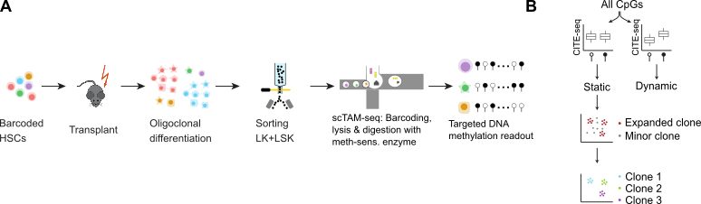

## Experimental design

This vignette describes how to generate the plots for Figure 2 of the EPI-Clone manuscript. Specifically, it shows how experiment
M.1: LARRY main experiment reveals that DNA methylation pattern jointly encode DNA methylation and clonal identity.



```{r setup, include=FALSE}
knitr::opts_chunk$set(echo = TRUE)
require(ggplot2)
plot_theme_legend <- theme(panel.background = element_rect(color='black',fill='white'),
                          panel.grid=element_blank(),
                          text=element_text(color='black',size=8),
                          axis.text=element_text(color='black',size=8),
                          axis.ticks=element_line(color='black', size=.1),
                          strip.background = element_blank(),
                          legend.key=element_rect(color='black', fill=NA),
                          legend.key.size = unit(2, 'mm'),
                          strip.text = element_text(color='black',size=8))
plot_theme <- theme(panel.background = element_rect(color='black',fill='white'),
                          panel.grid=element_blank(),
                          text=element_text(color='black',size=8),
                          axis.text=element_text(color='black',size=8),
                          axis.ticks=element_line(color='black', size=.1),
                          strip.background = element_blank(),
                          legend.position = 'none',
                          strip.text = element_text(color='black',size=8))
cols_chrom <- c('active/weak promoter'='#ff678c',
          'Enhancer'='#ffdc64',
          'transcription'='#008c64',
          'Heterochromatin'='#6e1e8c',
          'weak enhancer'='#ffff00',
          'H3K9me3-repressed'='#787878',
          'Other'='#aaaaaa',
          'H3K9me3-repressed'='#f0f0f0')
celltypeColors <- c("HSC/MPP1"="maroon4",
                    "MPP2" ="darkgrey",
                    "MPP3" = "darkblue",
                    "MPP4" = "darkgreen",
                    "MEP"="#D5392C",
                    "EryP" = "#ED7950",
                    "MkP 1" = "#BDA8CB",
                    "MkP 2" = "#D36494",
                    "GMP" = "#C3C380",
                    "pre/pro-B" ="#94B1F9")
plot_path <- '~'
```

This vignette introduces the EPI-Clone algorithm in detail. The convenient wrapper function  `epiclone` is described in the main readme of the github repo.

## Unsupervised uMAP (Figure 1b,c)

First we load the data and perform an unsupervised dimensionality reduction of all CpGs.

```{r readData, warning=F, message=F}
require(Seurat)
require(ggplot2)
require(ROCR)
require(fossil)
require(reshape2)
require(pheatmap)
require(GenomicRanges)
full_seurat <- readRDS(url('https://figshare.com/ndownloader/files/42479346'))
larry <- subset(full_seurat, Experiment == "LARRY main experiment")
```

We perform straightforward Seurat dimensionality reduction

```{r full_seurat, message=FALSE, warning=FALSE}
usecpg <- rownames(larry)
larry <- ScaleData(larry, assay = "DNAm", features = usecpg, verbose = F)
larry <- RunPCA(larry, assay = "DNAm", features = usecpg, reduction.name = "pca", reduction.key = "PC_", npcs = 100, verbose = F)
larry <- RunUMAP(larry, reduction = "pca", dims = 1:50, verbose = F)
```


```{r setupcolors, echo = F}
cloneorder <- table(larry$LARRY)
bigclones <- names(cloneorder)[cloneorder/sum(cloneorder) > 0.01]
cloneorder <- names(cloneorder)[order(cloneorder, decreasing = T)]
cloneColors.here <- scales::grey_pal(end = 1)(length(unique(cloneorder)))
names(cloneColors.here) <- cloneorder
cloneColors.here[bigclones] <- scales::hue_pal()(length(bigclones))
```

We can highlight on this the *Celltype* annotation. See the other [vignette](../Figure1/Figure1.Rmd) for Figure 1 on how it was obtained.

```{r fig1b_celltype_all, fig.width=4,fig.height=4}
DimPlot(larry, group.by = "CellType",reduction="umap") + ggtitle("") + NoAxes() + NoLegend() + scale_color_manual(values = celltypeColors)
```

In the main figure of the manuscript we show only the cells that carry a LARRY barcode. The cells where no LARRY barcode was observed (`r sprintf("%.1f %%", 100*mean(is.na(larry$LARRY)))` of cells - due to dropout, or cells falsely sorted as LARRY+ in the FACS) follow a similar distribution.

```{r fig1b_clone_all, fig.width=6,fig.height=4}
cloneorder <- table(larry$LARRY)
cloneorder <- names(cloneorder)[order(cloneorder, decreasing = T)]

cloneColors.here <- scales::hue_pal()(length(cloneorder))
names(cloneColors.here) <- sample(names(cloneColors.here), length(names(cloneColors.here)))
cloneColors.here <- sample(cloneColors.here, length(cloneColors.here))
larry$use <- ifelse(!is.na(larry$LARRY), "LARRY barcode", "no LARRY barcode")
DimPlot(subset(larry, subset=use=="LARRY barcode"), group.by = "LARRY",reduction="umap", order=cloneorder) + ggtitle("") + NoAxes() + NoLegend() + scale_color_manual(values = cloneColors.here)
```

Here, different shades of grey correspond to different LARRY clones represented with up to 30 cells and different colors correspond to different LARRY clones represented with >30 cells.

This plot suggests that overall, the methylome is impacted both by differentiation state and the clonal identity.

## Identification of static CpGs (Figure 1d)

To more cleanly identify clones, EPI-Clone first looks for CpGs that are *not* associated with differentiation. We use surface antigen expression as a proxy for differentiation, since it is completely independent of methylation; alternatively, if you have good cell state annotation obtained from methylation (see also other vignette on cell state), this can be used as well.  The `epiclone` wrapper function can handle both cases.

```{r epiclone_pt1a, warning=FALSE, message=FALSE}
min_cells <- 10

#compute minimum pvalue for asociation with (any) protein
suppressWarnings({
  pvals <- apply(larry@assays$DNAm@data,1, function(met) {
    apply(larry@assays$AB@data, 1, function(prot) {
      use <- !is.na(prot)
      a <- prot[use][met[use]==1]
      b <- prot[use][met[use]==0]
      if (length(a) < min_cells | length(b) < min_cells) return(1) else return(ks.test(a,b)$p.value)
    })
})
min_pval <- apply(pvals, 2, min)

#establish bonferroni criterion
thr.protein.ass <- 1/(nrow(larry@assays$DNAm@data) * nrow(larry@assays$AB@data))

#determine average overall methylation level
avg_meth_rate <- apply(larry@assays$DNAm@data, 1, mean)
})
```


We use the LARRY labels to compute, for each CpG, the statistical association with clone (more accurately, any clone bigger than 30 cells). This value is only used for plotting but not for selecting CpGs, so of course, EPI-Clone also workd without clonal labels

```{r epiclone_pt1b, fig.width=5,fig.height=3}
trueClone <- "LARRY"
ncells.bigClone <- 30
upper.thr.methrate <- 0.9
lower.thr.methrate <- 0.25
true_clone <- larry@meta.data[,trueClone]
for_prediction <- larry

for_prediction$use <- !is.na(true_clone)
for_prediction <- subset(for_prediction, use)
a <-table(for_prediction@meta.data[,trueClone])
use_for_prediction <- names(a)[a > ncells.bigClone]
for_prediction$use <- for_prediction@meta.data[,trueClone] %in% use_for_prediction
for_prediction <- subset(for_prediction,use)

cloneid <- factor(for_prediction@meta.data[,trueClone], levels = unique(for_prediction@meta.data[,trueClone]))
suppressWarnings({
  pvals_cloneass <- p.adjust(apply(for_prediction@assays[["DNAm"]]@data,1,function(met) {
  chisq.test(table(met,cloneid))$p.value
}),method = "bonferroni")
})

CpGSelection <- data.frame(CpG = names(pvals_cloneass), avg_meth_rate, min_pval, pvals_cloneass)
selected_not_protein <- names(min_pval)[min_pval > thr.protein.ass & avg_meth_rate < upper.thr.methrate & avg_meth_rate > lower.thr.methrate]
CpGSelection$Type <- ifelse(row.names(CpGSelection)%in%selected_not_protein, 'Static', ifelse(avg_meth_rate < upper.thr.methrate & avg_meth_rate > lower.thr.methrate, 'Dynamic', NA))
write.csv(CpGSelection, '../../out/cpg_selection.csv')
panel <- read.table('../../infos/panel_info_dropout_pwm.tsv',
                    sep='\t',
                    header=TRUE)

to_plot <- data.frame(PVal=min_pval,
                      AvgMeth=avg_meth_rate,
                      PValClone=pvals_cloneass)

ggplot(to_plot, aes(x = AvgMeth, y = log10(ifelse(PVal<1e-21, 1e-21, PVal)), color = -log10(PValClone+1e-50)))+
  geom_point(size=.5, stroke=.5)+
  geom_hline(yintercept = log10(thr.protein.ass)) + geom_vline(xintercept = c(lower.thr.methrate,upper.thr.methrate)) +
  plot_theme + xlab("Average methylation") + ylab(ifelse(is.null(thr.protein.ass), "p value cell state association", "Association with surface\nprotein [log10]")) +
  scale_color_gradientn(colours = c("black","blue","red"), name = "-log10 p-val\nClone association")+
  scale_y_continuous(breaks=c(0, -7.5, -15), limits = c(-22,5))
```

The `r sprintf("n = %d", length(selected_not_protein))` dots in the upper central rectangle of this plot (Figure 1D) are of interest as static CpGs and used further for clustering of clones

## Check the localization of static vs. dynamic CpGs (Figure 1e)

```{r clonal_CpGs_genomic_distribution, fig.width=5,fig.height=3}
panel_info <- read.table('../../infos/panel_info_dropout_pwm.tsv',
                         sep='\t')
plot_dat <- panel_info[row.names(CpGSelection), 'ChromState', drop=FALSE]
plot_dat$ChromState <- c("active/weak promoter"='Other',
                        "heterochromatin"="Heterochromatin",
                        "poised promoter"='Other',
                        "strong enhancer"='Enhancer',
                        "transcription"='Other',
                        "weak enhancer"='Enhancer')[plot_dat$ChromState]
plot_dat <- data.frame(plot_dat[ ,'ChromState', drop=FALSE], CpGSelection)
plot_dat <- na.omit(plot_dat)
to_plot_dynamic <- plyr::count(plot_dat[plot_dat$Type=='Dynamic', ])
to_plot_static <- plyr::count(plot_dat[plot_dat$Type=='Static', ])
to_plot_dynamic$freq <- as.numeric(to_plot_dynamic$freq/sum(to_plot_dynamic$freq))
to_plot_static$freq <- as.numeric(to_plot_static$freq/sum(to_plot_static$freq))
to_plot <- rbind(to_plot_dynamic, to_plot_static)
fisher.p <- fisher.test(table(plot_dat[plot_dat$ChromState!='Other', c('Type', 'ChromState')]))
ggplot(to_plot, aes(x=Type, y=freq*100, fill=ChromState))+geom_bar(stat = 'identity')+plot_theme+scale_fill_manual(values=cols_chrom)+xlab('CpG Class')+ylab('%of CpGs in chromatin state')
```

Static CpGs are enriched in heterochromatic regions with p-value `r paste(fisher.p$p.value)`.


## Visualization of default methylation state

```{r methylation_stae}
meth_cpgs <- GetAssayData(larry, assay="DNAm", slot='counts')
plot_dat <- data.frame(Type=CpGSelection$Type, Methylation=ifelse(rowMeans(meth_cpgs[row.names(CpGSelection),])>0.5, 'Methylated', 'Unmethylated'))
to_plot <- plyr::count(na.omit(plot_dat))
to_plot[to_plot$Type=='Dynamic', 'freq'] <- to_plot[to_plot$Type=='Dynamic', 'freq']/sum(to_plot[to_plot$Type=='Dynamic', 'freq'])
to_plot[to_plot$Type=='Static', 'freq'] <- to_plot[to_plot$Type=='Static', 'freq']/sum(to_plot[to_plot$Type=='Static', 'freq'])
ggplot(to_plot, aes(x=Type, y=freq*100, fill=Methylation))+geom_bar(stat = 'identity')+plot_theme+xlab('CpG Class')+ylab('%of CpGs')+scale_fill_manual(values=c('Methylated'='#000000ff','Unmethylated'='#fcffa4ff'))
```
