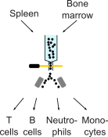

## Experimental design

This vignette the second part of Figure 3, in which we employed EPI-clone on barcoded, mature immune cells from spleen and bone marrow (experiment M.5).



```{r setup, include=FALSE}
knitr::opts_chunk$set(echo = TRUE)
require(ggplot2)
require(ggpubr)
require(ggrepel)
require(RColorBrewer)
require(plotrix)
plot_theme_legend <- theme(panel.background = element_rect(color='black',fill='white'),
                           panel.grid=element_blank(),
                           text=element_text(color='black',size=10),
                           axis.text=element_text(color='black',size=10),
                           axis.ticks=element_line(color='black', size=.1),
                           strip.background = element_blank(),
                           legend.key=element_rect(color='black', fill=NA),
                           legend.key.size = unit(2, 'mm'),
                           strip.text = element_text(color='black',size=10))
plot_theme <- theme(panel.background = element_rect(color='black',fill='white'),
                    panel.grid=element_blank(),
                    text=element_text(color='black',size=10),
                    axis.text=element_text(color='black',size=10),
                    axis.ticks=element_line(color='black', size=.1),
                    strip.background = element_blank(),
                    legend.position = 'none',
                    strip.text = element_text(color='black',size=10))
cols_chrom <- c('active/weak promoter'='#ff678c',
                'Enhancer'='#ffdc64',
                'transcription'='#008c64',
                'Heterochromatin'='#6e1e8c',
                'weak enhancer'='#ffff00',
                'H3K9me3-repressed'='#787878',
                'Other'='#aaaaaa',
                'H3K9me3-repressed'='#f0f0f0')
celltypeColors <- c("HSC/MPP1"="maroon4",
                    "MPP2" ="darkgrey",
                    "MPP3/4" = "darkblue",
                    "MEP" = "#ED7950",
                    "MkP" = "#BDA8CB",
                    "GMP" = "#C3C380",
                    "Monocytes" = "#C3C380",
                    'Myeloid'='#e5e500',
                    'Neutrophils'='#bfff40',
                    'Macrophages'='darkgreen',
                    'unkn myeloid'='#bfbf30',
                    "B cells 1" ="#94B1F9",
                    "B cells 2" ="#94DAFF",
                    "CD4+ T cells"="#ed1d24",
                    'CD8+ T cells'="#f89a11",
                    'NK cells'="#2e3184")
simpleCTmap <- c("pre/pro-B"="lymphoid",
                 "MEP"="erythroid",
                 "EryP"="erythroid",
                 "GMP"="myeloid",
                 "MPP4"="myeloid",
                 "MPP3"=NA,
                 "HSC/MPP1"="immature",
                 "MkP 1"="MkP",
                 "MkP 2"="MkP",
                 "MPP2"="immature")
qual_cols <- brewer.pal.info[brewer.pal.info$category == 'qual',]
cols <- unlist(mapply(brewer.pal, qual_cols$maxcolors, rownames(qual_cols)))
source('../../scripts/helper_functions.R')
source('../../scripts/EPIClone.R')
panel <- read.table('../../infos/panel_info_dropout_pwm.tsv',
                    sep='\t')
```

## Loading

```{r loading}
seurat_obj <- readRDS(url('https://figshare.com/ndownloader/files/50835297'))
```

## EPI-clone

```{r pressure, echo=FALSE}
npcs <- 100
thrbig <- 0.5
static_cpgs <- read.csv('../../infos/cpg_selection.csv',
                  row.names = 1)
static_cpgs <- row.names(static_cpgs[which(static_cpgs$Type=='Static'), ])
seurat_obj$Sample <- 'MatureMyeloid'
seurat_obj$use <- !is.na(seurat_obj$LARRY)
epiclone_obj <- epiclone(seurat_obj, plotFolder = '.', tuneParams = F, res.Clustering = 3,
                    npcs.Clustering = npcs, selected.CpGs = static_cpgs, trueClone = "LARRY", batch = "Sample", protein.assay.name = NULL, 
                    thr.bigCloneSelection = thrbig,npcs.bigCloneSelection = npcs, smoothen.bigCloneSelection = 20, celltype = "CellType",
                    bigClone.relSize = 0.0025, returnIntermediateSeurat = F)
```

```{r visualize_results}
epiclone_seurat <- epiclone_obj$finalSeurat
DimPlot(epiclone_seurat, reduction = 'cloneUMAP', group.by = c('LARRY'))+NoLegend()+NoAxes()+ggtitle('')
```

```{r epiclone_cell_state}
DimPlot(epiclone_seurat, reduction = 'cloneUMAP', group.by = 'CellType')+scale_color_manual(values=celltypeColors)
```

```{r performance_per_cluster}
adj_rand <- sapply(unique(epiclone_seurat$CellType), function(ct){
  adj.rand.index(as.integer(as.factor(epiclone_seurat$LARRY))[epiclone_seurat$CellType==ct], as.integer(as.factor(Idents(epiclone_seurat)))[epiclone_seurat$CellType==ct])
})
to_plot <- data.frame(CellType=unique(epiclone_seurat$CellType), AdjRand=adj_rand)

ggplot(to_plot, aes(x=CellType, y=AdjRand, fill=CellType))+geom_histogram(stat='identity')+plot_theme+
  theme(axis.text.x = element_text(angle=45, hjust=1))+scale_fill_manual(values=celltypeColors)
```

```{r plot_heatmap}
pheatmap(epiclone_obj$forheatmap,
         cluster_cols = F,
         fontsize_col=6,
         clustering_distance_rows = dist(epiclone_obj$forheatmap),
         color = colorRampPalette(c("white","blue","purple","red"))(100),
         show_rownames=FALSE)
```

We now investigated whether there is a relationship between EPI-clone performance and surface markers expression.

```{r associate_perfomance}
summarized_expression <- aggregate(t(GetAssayData(epiclone_seurat, 'AB')), by=list(epiclone_seurat$CellType), mean)
cor(adj_rand, summarized_expression[,-1])
plot(adj_rand, summarized_expression$`CD8-raw`)
```

```{r static_cell_types}
DimPlot(epiclone_seurat,
        reduction='cloneUMAP',
        group.by='CellType')+scale_color_manual(values = celltypeColors)+ggtitle("")+NoAxes()
```