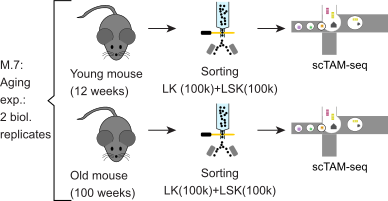

## Experimental design

This vignette highlights the analysis of experiment M.7 of the EPI-Clone manuscript, which investigates clonal dynamics during native murine aging.


  
```{r setup, include=FALSE}
knitr::opts_chunk$set(echo = TRUE)
require(ggplot2)
require(ggpubr)
require(ggrepel)
require(RColorBrewer)
require(plotrix)
plot_theme_legend <- theme(panel.background = element_rect(color='black',fill='white'),
                           panel.grid=element_blank(),
                           text=element_text(color='black',size=8),
                           axis.text=element_text(color='black',size=8),
                           axis.ticks=element_line(color='black', size=.1),
                           strip.background = element_blank(),
                           legend.key=element_rect(color='black', fill=NA),
                           legend.key.size = unit(2, 'mm'),
                           strip.text = element_text(color='black',size=8))
plot_theme <- theme(panel.background = element_rect(color='black',fill='white'),
                    panel.grid=element_blank(),
                    text=element_text(color='black',size=8),
                    axis.text=element_text(color='black',size=8),
                    axis.ticks=element_line(color='black', size=.1),
                    strip.background = element_blank(),
                    legend.position = 'none',
                    strip.text = element_text(color='black',size=8))
cols_chrom <- c('active/weak promoter'='#ff678c',
                'Enhancer'='#ffdc64',
                'transcription'='#008c64',
                'Heterochromatin'='#6e1e8c',
                'weak enhancer'='#ffff00',
                'H3K9me3-repressed'='#787878',
                'Other'='#aaaaaa',
                'H3K9me3-repressed'='#f0f0f0')
celltypeColors <- c("HSC/MPP1"="maroon4",
                    "MPP2" ="darkgrey",
                    "MPP3" = "darkblue",
                    "MPP4" = "darkgreen",
                    "MEP"="#D5392C",
                    "EryP" = "#ED7950",
                    "MkP 1" = "#BDA8CB",
                    "MkP 2" = "#D36494",
                    "GMP" = "#C3C380",
                    "pre/pro-B" ="#94B1F9")
simpleCTmap <- c("pre/pro-B"="lymphoid",
                 "MEP"="erythroid",
                 "EryP"="erythroid",
                 "GMP"="myeloid",
                 "MPP4"="myeloid",
                 "MPP3"=NA,
                 "HSC/MPP1"="immature",
                 "MkP 1"="MkP",
                 "MkP 2"="MkP",
                 "MPP2"="immature")
qual_cols <- brewer.pal.info[brewer.pal.info$category == 'qual',]
cols <- unlist(mapply(brewer.pal, qual_cols$maxcolors, rownames(qual_cols)))
source('../../scripts/helper_functions.R')
source('../../scripts/EPIClone.R')
panel <- read.table('../../infos/panel_info_dropout_pwm.tsv',
                    sep='\t')
```


## Unsupervised uMAP


```{r readData, warning=F, message=F}
require(Seurat)
require(ggplot2)
require(ROCR)
require(fossil)
require(reshape2)
require(pheatmap)
require(GenomicRanges)
require(ComplexHeatmap)
require(viridis)
full_seurat <- readRDS(url('https://figshare.com/ndownloader/files/45262060'))
cpgs <- read.csv('../../infos/cpg_selection.csv', row.names = 1)
dynamic_cpgs <- row.names(subset(cpgs, subset=Type=='Dynamic'))
static_cpgs <- row.names(subset(cpgs, subset=Type=='Static'))
```

## Run EPIclone

```{r execute_epiclone}
npcs <- 100
thrbig <- 1
epi_old <- epiclone(subset(full_seurat, Sample == "Old"), plotFolder = '.', tuneParams = F, 
                    npcs.Clustering = npcs, selected.CpGs = static_cpgs, trueClone = NULL, batch = "Sample", protein.assay.name = NULL, 
                    thr.bigCloneSelection = thrbig,npcs.bigCloneSelection = npcs, smoothen.bigCloneSelection = 20, celltype = "CellType",
                    bigClone.relSize = 0.01, returnIntermediateSeurat = F)
epi_young <- epiclone(subset(full_seurat, Sample == "Young"), plotFolder = '.', tuneParams = F, 
                      npcs.Clustering = npcs, selected.CpGs = static_cpgs, trueClone = NULL, batch = "Sample", protein.assay.name = NULL, 
                      thr.bigCloneSelection = thrbig,npcs.bigCloneSelection = npcs, smoothen.bigCloneSelection = 20, celltype = "CellType",
                      bigClone.relSize = 0.01, returnIntermediateSeurat = F)

```

## Visualize clonal UMAP of young mouse

In contrast to the transplantation setting, we expect a more polyclonal setting in native hematopoiesis. Thus, we change the threshold for selecting big clones from 0.5% to a more stringent 1%.

```{r clonal_umaps}
plot_theme_legend <- theme(panel.background = element_rect(color='black',fill='white'),
                           panel.grid=element_blank(),
                           text=element_text(color='black',size=8),
                           axis.text=element_text(color='black',size=8),
                           axis.ticks=element_line(color='black', size=.1),
                           strip.background = element_blank(),
                           legend.key=element_rect(color='black', fill=NA),
                           legend.key.size = unit(2, 'mm'),
                           strip.text = element_text(color='black',size=8))
plot_theme <- theme(panel.background = element_rect(color='black',fill='white'),
                    panel.grid=element_blank(),
                    text=element_text(color='black',size=8),
                    axis.text=element_text(color='black',size=8),
                    axis.ticks=element_line(color='black', size=.1),
                    strip.background = element_blank(),
                    legend.position = 'none',
                    strip.text = element_text(color='black',size=8))
epi_old_seurat <- epi_old$finalSeurat
clones <- as.character(epi_old_seurat$seurat_clusters)
sizes_old <- plyr::count(clones)
sizes_old$RelFreq <- sizes_old$freq/sum(sizes_old$freq)
small_clones <- sizes_old$x[sizes_old$RelFreq<=0.01]
epi_old_seurat$seurat_clusters[epi_old_seurat$seurat_clusters%in%small_clones] <- NA
epi_young_seurat <- epi_young$finalSeurat
clones <- as.character(epi_young_seurat$seurat_clusters)
sizes_young <- plyr::count(clones)
sizes_young$RelFreq <- sizes_young$freq/sum(sizes_young$freq)
small_clones <- sizes_young$x[sizes_young$RelFreq<=0.01]
epi_young_seurat$seurat_clusters[epi_young_seurat$seurat_clusters%in%small_clones] <- NA
to_plot <- data.frame(epi_young_seurat[["cloneUMAP"]]@cell.embeddings, Clone=epi_young_seurat$seurat_clusters)
to_plot <- to_plot[order(to_plot$Clone, na.last = FALSE), ]
ggplot(to_plot, aes(x=CLONEUMAP_1 , y=CLONEUMAP_2, color=Clone))+geom_point(size=.25)+NoAxes()+NoLegend()+plot_theme+scale_color_manual(values=c(cols, cols), na.value = 'gray75')+theme(panel.background = element_blank())
write.csv(to_plot, '/home/mscherer/cluster/project/Methylome/analysis/HSCs/paper/revision/figures/Figure3/source_data/Fig3A.csv')
```

```{r compare_cluster_sizes}
clones <- as.character(epi_old_seurat$seurat_clusters)
sizes_old <- plyr::count(clones)
sizes_old$RelFreq <- (sizes_old$freq)/sum((sizes_old$freq))
sizes_old$Sample <- 'Old'
clones <- as.character(epi_young_seurat$seurat_clusters)
sizes_young <- plyr::count(clones)
sizes_young$RelFreq <- (sizes_young$freq)/sum((sizes_young$freq))
sizes_young$Sample <- 'Young'
to_plot <- sizes_young
to_plot$x <- factor(to_plot$x, levels=to_plot$x[order(to_plot$RelFreq, decreasing = TRUE)])

ggplot(to_plot, aes(x='', y=RelFreq, fill=x))+geom_histogram(stat='identity', position = 'stack', width=1) +
  coord_polar("y", start=0)+plot_theme+ylab('Frequency')+scale_fill_manual(values=c(cols, cols), na.value='gray75')+ylab('')+xlab('')+theme(axis.text.x=element_blank(), panel.background = element_blank())
```

## Cell state UMAP

```{r cell_state}
DimPlot(full_seurat, group.by = 'CellType')+scale_color_manual(values=celltypeColors)+NoAxes()+NoLegend()+ggtitle('')
```

```{r cellTypeDistribution}
sizes_old <- plyr::count(subset(full_seurat, Sample=='Old')$CellType)
sizes_old$RelFreq <- (sizes_old$freq)/sum((sizes_old$freq))
sizes_old$Sample <- 'Old'
sizes_young <- plyr::count(subset(full_seurat, Sample=='Young')$CellType)
sizes_young$RelFreq <- (sizes_young$freq)/sum((sizes_young$freq))
sizes_young$Sample <- 'Young'
to_plot <- data.frame(rbind(sizes_old, sizes_young))
ggplot(to_plot, aes(x=Sample, y=RelFreq, fill=x))+geom_histogram(stat='identity', position = 'stack')+scale_fill_manual(values = celltypeColors)+plot_theme+ylab('Frequency')
```

```{r clonal_umap_old}
to_plot <- data.frame(epi_old_seurat[["cloneUMAP"]]@cell.embeddings, Clone=epi_old_seurat$seurat_clusters)
to_plot <- to_plot[order(to_plot$Clone, na.last = FALSE), ]
ggplot(to_plot, aes(x=CLONEUMAP_1 , y=CLONEUMAP_2, color=Clone))+geom_point(size=.25)+NoAxes()+NoLegend()+plot_theme+scale_color_manual(values=cols, na.value = 'gray75')+theme(panel.background = element_blank())
write.csv(to_plot, '/home/mscherer/cluster/project/Methylome/analysis/HSCs/paper/revision/figures/Figure3/source_data/Fig3B.csv')
```

```{r clone_sizes_old}
clones <- as.character(epi_old_seurat$seurat_clusters)
sizes_old <- plyr::count(clones)
sizes_old$RelFreq <- (sizes_old$freq)/sum((sizes_old$freq))
sizes_old$Sample <- 'Old'
to_plot <- sizes_old
to_plot$x <- factor(to_plot$x, levels=to_plot$x[order(to_plot$RelFreq, decreasing = TRUE)])
qual_cols <- brewer.pal.info[brewer.pal.info$category == 'qual',]
cols <- unlist(mapply(brewer.pal, qual_cols$maxcolors, rownames(qual_cols)))

ggplot(to_plot, aes(x='', y=RelFreq, fill=x))+geom_histogram(stat='identity', position = 'stack', width=1) +
  coord_polar("y", start=0)+plot_theme+ylab('Frequency')+scale_fill_manual(values=cols, na.value='gray75')+ylab('')+xlab('')+theme(axis.text.x=element_blank(), panel.background = element_blank())
```

```{r compare_clone_sizes}
clones <- as.character(epi_old_seurat$seurat_clusters)
sizes_old <- plyr::count(clones)
sizes_old$RelFreq <- (sizes_old$freq)/sum((sizes_old$freq))
sizes_old$Sample <- 'Old'
clones <- as.character(epi_young_seurat$seurat_clusters)
sizes_young <- plyr::count(clones)
sizes_young$RelFreq <- (sizes_young$freq)/sum((sizes_young$freq))
sizes_young$Sample <- 'Young'
to_plot <- rbind(sizes_old, sizes_young)
to_plot$Replicate <- 'Replicate1'
rep2 <- read.csv('../../infos/compare_clone_sizes.csv', row.names=1)
rep2$Replicate <- 'Replicate2'
to_plot <- rbind(to_plot, rep2)
ggplot(to_plot, aes(x=Sample, y=RelFreq, fill=x))+geom_histogram(stat='identity')+plot_theme+scale_fill_manual(values=c(cols, cols), na.value = 'gray75')+facet_wrap(Replicate~., nrow=1)
write.csv(to_plot, '/home/mscherer/cluster/project/Methylome/analysis/HSCs/paper/revision/figures/Figure3/source_data/Fig3C.csv')
print(paste('Old big clone (rep1)', sum(sizes_old[!is.na(sizes_old$x), 'RelFreq']), 'Small clones:', sizes_old[is.na(sizes_old$x), 'RelFreq']))
print(paste('Old big clone (rep2)', sum(rep2[!is.na(rep2$x)&rep2$Sample=='Old', 'RelFreq']), 'Small clones:', rep2[is.na(rep2$x)&rep2$Sample=='Old', 'RelFreq']))
print(paste('Young big clone', sum(sizes_young[!is.na(sizes_young$x), 'RelFreq']), 'Small clones:', sizes_young[is.na(sizes_young$x), 'RelFreq']))
print(paste('Young big clone (rep2)', sum(rep2[!is.na(rep2$x)&rep2$Sample=='Young', 'RelFreq']), 'Small clones:', rep2[is.na(rep2$x)&rep2$Sample=='Young', 'RelFreq']))
```

We now also compare the number of expanded clones in the four experiments.

```{r compare_numbers}
table(to_plot[,c('Sample', 'Replicate')])
```

```{r largest_clones}
clones <- as.character(epi_old_seurat$seurat_clusters)
sizes_old <- plyr::count(clones)
sizes_old$RelFreq <- (sizes_old$freq)/sum((sizes_old$freq))
sizes_old$Sample <- 'Old'
sizes_old <- sizes_old[!is.na(sizes_old$x), ]
sizes_old <- sizes_old[order(sizes_old$RelFreq, decreasing = TRUE), ]
sizes_old$x <- 1:nrow(sizes_old)
clones <- as.character(epi_young_seurat$seurat_clusters)
sizes_young <- plyr::count(clones)
sizes_young$RelFreq <- (sizes_young$freq)/sum((sizes_young$freq))
sizes_young$Sample <- 'Young'
sizes_young <- sizes_young[!is.na(sizes_young$x), ]
sizes_young <- sizes_young[order(sizes_young$RelFreq, decreasing = TRUE), ]
sizes_young$x <- 1:nrow(sizes_young)
to_plot <- data.frame(rbind(sizes_old[1:20, ], sizes_young[1:20, ]))
to_plot$Replicate <- 'Replicate1'
rep2 <- read.csv('../../infos/compare_cluster_sizes_largest.csv',
                 row.names=1)
rep2$Replicate <- 'Replicate2'
to_plot <- rbind(to_plot, rep2)
ggplot(to_plot, aes(x=x, y=RelFreq, fill=Sample, color=Replicate))+geom_histogram(stat='identity', position = 'dodge', size=.1)+scale_fill_manual(values=c('Old'='gray75', 'Young'='gray25'))+scale_color_manual(values=c('Replicate1'='black', 'Replicate2'='black'))+plot_theme+xlab('Clone by size')+theme(axis.text.x = element_blank())+ylab('Frequency')
```

```{r statistics_clone_sizes}
ggplot(to_plot, aes(x=Sample, y=RelFreq))+geom_boxplot()+plot_theme
wilcox.test(to_plot$RelFreq[to_plot$Sample=='Old'], to_plot$RelFreq[to_plot$Sample=='Young'])
```

```{r clonal_output_old}
clones <- as.character(epi_old_seurat$seurat_clusters)
clone_counts <- na.omit(plyr::count(clones))
rowinfo <- data.frame(CellType=epi_old_seurat$CellType, Clone=clones)
rowinfo$CloneCount <- NA
for(i in 1:nrow(clone_counts)){
  rowinfo[(rowinfo$Clone%in%clone_counts$x[i]), 'CloneCount'] <- clone_counts$freq[i]
}
clonal_cpgs_mat <- GetAssayData(epi_old_seurat, assay = 'DNAm', slot = 'counts')[static_cpgs, ]
clone_methylation_mat <- sapply(na.omit(unique(as.character(epi_old_seurat$seurat_clusters))), function(x){
  cells_on_clones <- clonal_cpgs_mat[, which(as.character(epi_old_seurat$seurat_clusters)==x), drop=FALSE]
  round(rowMeans(cells_on_clones))
})

total_counts_mat <- sapply(na.omit(unique(as.character(epi_old_seurat$seurat_clusters))), function(x){
  cells_on_clones <- epi_old_seurat[[]][which(as.character(epi_old_seurat$seurat_clusters)==x), 'TotalCounts']
  mean(cells_on_clones)
})

rowinfo$SimpleCellType <- simpleCTmap[as.character(rowinfo$CellType)]
frequencies <- as.data.frame(matrix(NA, nrow = length(clone_counts$x), ncol = length(na.omit(unique(rowinfo$SimpleCellType)))))
row.names(frequencies) <- clone_counts$x
colnames(frequencies) <- na.omit(unique(rowinfo$SimpleCellType))
rowinfo_young <- epi_young_seurat[[]]
ct_counts_young <- table(rowinfo_young$CellType)
ct_counts_old <- table(rowinfo$CellType)
rowinfo <- rowinfo[!is.na(rowinfo$SimpleCellType), ]
for(x in clone_counts$x){
  counts <- plyr::count(rowinfo[rowinfo$Clone%in%x, 'SimpleCellType'])
  frequencies[x, counts$x] <- counts$freq
}
clone_sizes <- rowSums(frequencies, na.rm = TRUE)
frequencies[is.na(frequencies)] <- 0
frequencies <- apply(frequencies, 2, function(x)x/sum(x))
frequencies <- frequencies/rowSums(frequencies)
clust <- cutree(hclust(dist(frequencies, 'euclidean'), method='ward.D2'), 5)
clust_annotation <- c('1'='Myeloid Biased',
                      '2'='Balanced',
                      '3'='Balanced',
                      '4'='Lymphoid Biased',
                      '5'='Immature')
row_anno_fr <- data.frame(Annotation=ifelse(frequencies[,'immature']>0.3, 'Immature', 'Other'), row.names = clone_counts$x)
row_anno_fr <- row_anno_fr[order(frequencies[,'immature']), , drop=FALSE]
frequencies <- frequencies[order(frequencies[,'immature']),]
row_anno <- HeatmapAnnotation(df=row_anno_fr,
                              show_legend = FALSE,
                              which='row',
                              col = list(Annotation=c('Other'='gray50',
                                                      'Myeloid Biased'="#C3C380",
                                                      "Immature"="maroon4",
                                                      "Lymphoid Biased"="#94B1F9")),
                              show_annotation_name = FALSE,
                              CloneSize=anno_barplot(clone_sizes)) 
#                              Residuals=anno_barplot(epimutations$Residuals))
hm <- ComplexHeatmap::Heatmap(frequencies[, c('immature', 'erythroid', 'myeloid', 'lymphoid')],
                              show_row_names = FALSE,
                              col = viridis(50),
                              cluster_rows = FALSE,
                              cluster_columns = FALSE,
                              clustering_distance_rows = 'euclidean',
                              clustering_method_rows = 'ward.D2',
                              show_heatmap_legend =FALSE,
                              right_annotation = row_anno,
                              column_names_gp = grid::gpar(fontsize = 8))
draw(hm)

frequencies_old <- frequencies
frequencies_old <- data.frame(frequencies_old)
frequencies_old$Annotation <- row_anno_fr$Annotation
immature_old <- data.frame(CellType=rowinfo$CellType, seurat_clusters=rowinfo$Clone)
```


```{r clonal_output_young}
clones <- as.character(epi_young_seurat$seurat_clusters)
clone_counts <- na.omit(plyr::count(clones))
rowinfo <- data.frame(CellType=epi_young_seurat$CellType, Clone=clones)
rowinfo$CloneCount <- NA
for(i in 1:nrow(clone_counts)){
  rowinfo[(rowinfo$Clone%in%clone_counts$x[i]), 'CloneCount'] <- clone_counts$freq[i]
}
clonal_cpgs_mat <- GetAssayData(epi_young_seurat, assay = 'DNAm', slot = 'counts')[static_cpgs, ]
clone_methylation_mat <- sapply(na.omit(unique(as.character(epi_young_seurat$seurat_clusters))), function(x){
  cells_on_clones <- clonal_cpgs_mat[, which(as.character(epi_young_seurat$seurat_clusters)==x), drop=FALSE]
  round(rowMeans(cells_on_clones))
})
total_counts_mat <- sapply(na.omit(unique(as.character(epi_young_seurat$seurat_clusters))), function(x){
  cells_on_clones <- epi_young_seurat[[]][which(as.character(epi_young_seurat$seurat_clusters)==x), 'TotalCounts']
  mean(cells_on_clones)
})

rowinfo$SimpleCellType <- simpleCTmap[as.character(rowinfo$CellType)]
frequencies <- as.data.frame(matrix(NA, nrow = length(clone_counts$x), ncol = length(na.omit(unique(rowinfo$SimpleCellType)))))
row.names(frequencies) <- clone_counts$x
colnames(frequencies) <- na.omit(unique(rowinfo$SimpleCellType))
rowinfo_old <- epi_old_seurat[[]]
ct_counts_young <- table(rowinfo$CellType)
ct_counts_old <- table(rowinfo_old$CellType)

rowinfo <- rowinfo[!is.na(rowinfo$SimpleCellType), ]
for(x in clone_counts$x){
  counts <- plyr::count(rowinfo[rowinfo$Clone%in%x, 'SimpleCellType'])
  frequencies[x, counts$x] <- counts$freq
}
clone_sizes <- rowSums(frequencies, na.rm = TRUE)
frequencies[is.na(frequencies)] <- 0
frequencies <- apply(frequencies, 2, function(x)x/sum(x))
frequencies <- frequencies/rowSums(frequencies)
clust <- cutree(hclust(dist(frequencies, 'euclidean'), method='ward.D2'), 6)
clust_annotation <- c('1'='Balanced',
                      '2'='Immature',
                      '3'='Balanced',
                      '4'='Lymphoid Biased',
                      '5'='Balanced',
                      '6'='Balanced')
row_anno_fr <- data.frame(Annotation=ifelse(frequencies[,'immature']>0.3, 'Immature', 'Other'), row.names = clone_counts$x)
row_anno_fr <- row_anno_fr[order(frequencies[,'immature']), , drop=FALSE]
frequencies <- frequencies[order(frequencies[,'immature']),]
row_anno <- HeatmapAnnotation(df=row_anno_fr,
                              show_legend = FALSE,
                              which='row',
                              col = list(Annotation=c('Other'='gray50',
                                                      'Myeloid Biased'="#C3C380",
                                                      "Immature"="maroon4",
                                                      "Lymphoid Biased"="#94B1F9")),
                              show_annotation_name = FALSE,
                              CloneSize=anno_barplot(clone_sizes)) 
#                              Residuals=anno_barplot(epimutations$Residuals))
hm <- ComplexHeatmap::Heatmap(frequencies[, c('immature', 'erythroid', 'myeloid', 'lymphoid')],
                              show_row_names = FALSE,
                              col = viridis(50),
                              cluster_rows = FALSE,
                              cluster_columns = FALSE,
                              clustering_distance_rows = 'euclidean',
                              clustering_method_rows = 'ward.D2',
                              show_heatmap_legend =FALSE,
                              right_annotation = row_anno,
                              column_names_gp = grid::gpar(fontsize = 8))
draw(hm)

frequencies <- data.frame(frequencies)
frequencies$Annotation <- row_anno_fr$Annotation
immature_young <- data.frame(CellType=rowinfo$CellType, seurat_clusters=rowinfo$Clone)

```

```{r stastics_myeloid_immature_young}
norm_myeloid <- frequencies$myeloid+frequencies$erythroid/sum(frequencies$myeloid+frequencies$erythroid)
norm_lymphoid <- frequencies$lymphoid/sum(frequencies$lymphoid)
```

```{r investigate_immature}
#Investigate the number of HSC being part of small and big clones
immature_old$CellType <- simpleCTmap[as.character(immature_old$CellType)]
immature_young$CellType <- simpleCTmap[as.character(immature_young$CellType)]
old_in_big_clone <- plyr::count(immature_old[immature_old$CellType=='immature', ])
old_in_big_clone$RelFreq <- old_in_big_clone$freq/(sum(old_in_big_clone$freq))
old_in_big_clone <- na.omit(old_in_big_clone)
old_in_big_clone <- old_in_big_clone[old_in_big_clone$CellType=='immature',]
young_in_big_clone <- plyr::count(immature_young[immature_young$CellType=='immature', ])
young_in_big_clone$RelFreq <- young_in_big_clone$freq/(sum(young_in_big_clone$freq))
young_in_big_clone <- na.omit(young_in_big_clone)
young_in_big_clone <- young_in_big_clone[young_in_big_clone$CellType=='immature',]
old_in_big_clone$Sample <- 'Old'
old_in_big_clone$seurat_clusters <- factor(old_in_big_clone$seurat_clusters, levels=
                                             old_in_big_clone$seurat_clusters[order(old_in_big_clone$freq, decreasing = TRUE)])
young_in_big_clone$Sample <- 'Young'
young_in_big_clone$seurat_clusters <- factor(young_in_big_clone$seurat_clusters, levels=
                                               young_in_big_clone$seurat_clusters[order(young_in_big_clone$freq, decreasing = TRUE)])
old_in_big_clone$CellType[old_in_big_clone$seurat_clusters=='Small clones'] <- NA
plot_old <- ggplot(old_in_big_clone[!is.na(old_in_big_clone$CellType),], aes(x=seurat_clusters, y=RelFreq, fill=CellType))+geom_histogram(stat='identity', position='dodge')+
  plot_theme+scale_fill_manual(values=celltypeColors)+xlab('Clones')+
  theme(axis.text.x = element_blank())+ylab('Percentage of all HSC/MPP1 cells')
young_in_big_clone$CellType[young_in_big_clone$seurat_clusters=='Small clones'] <- NA
plot_young <- ggplot(young_in_big_clone[!is.na(young_in_big_clone$CellType),], aes(x=seurat_clusters, y=RelFreq, fill=CellType))+geom_histogram(stat='identity', position='dodge')+
  plot_theme+scale_fill_manual(values=celltypeColors)+xlab('Clones')+
  theme(axis.text.x = element_blank())+ylab('')
grid.arrange(plot_old, plot_young, nrow=1)

old_in_big_clone <- old_in_big_clone[order(old_in_big_clone$RelFreq, decreasing = TRUE), ]
old_in_big_clone$seurat_clusters <- 1:nrow(old_in_big_clone)
young_in_big_clone <- young_in_big_clone[order(young_in_big_clone$RelFreq, decreasing = TRUE), ]
young_in_big_clone$seurat_clusters <- 1:nrow(young_in_big_clone)
to_plot <- rbind(old_in_big_clone[1:20, ], young_in_big_clone[1:20, ])
to_plot$Replicate <- 'Replicate1'
rep2 <- read.csv('../../infos/HSC_percentage_young_old.csv', row.names=1)
rep2$Replicate <- 'Replicate2'
to_plot <- rbind(to_plot, rep2)
ggplot(to_plot[!is.na(to_plot$CellType),], aes(x=seurat_clusters, y=RelFreq, fill=Sample, color=Replicate))+scale_color_manual(values=c('Replicate1'='black', 'Replicate2'='black'))+geom_histogram(stat='identity', position='dodge', size=.1)+
  plot_theme+scale_fill_manual(values=c('Old'='#cc246eff', 'Young'='#661237ff'))+xlab('Clones')+
  theme(axis.text.x = element_blank())+ylab('Percentage of all HSC/MPP1 in clone')
write.csv(to_plot[!is.na(to_plot$CellType),], '/home/mscherer/cluster/project/Methylome/analysis/HSCs/paper/revision/figures/Figure3/source_data/Fig3D1.csv')

```

```{r immature_statistics}
ggplot(to_plot, aes(x=Sample, y=RelFreq))+geom_boxplot()+plot_theme
wilcox.test(to_plot$RelFreq[to_plot$Sample=='Old'], to_plot$RelFreq[to_plot$Sample=='Young'])
```

```{r investigate_myeloid}
#Investigate the number of HSC being part of small and big clones
old_in_big_clone <- plyr::count(immature_old[immature_old$CellType=='myeloid', ])
old_in_big_clone$RelFreq <- old_in_big_clone$freq/(sum(old_in_big_clone$freq))
old_in_big_clone <- na.omit(old_in_big_clone)
old_in_big_clone <- old_in_big_clone[old_in_big_clone$CellType=='myeloid',]
young_in_big_clone <- plyr::count(immature_young[immature_young$CellType=='myeloid', ])
young_in_big_clone$RelFreq <- young_in_big_clone$freq/(sum(young_in_big_clone$freq))
young_in_big_clone <- na.omit(young_in_big_clone)
young_in_big_clone <- young_in_big_clone[young_in_big_clone$CellType=='myeloid',]
old_in_big_clone$Sample <- 'Old'
old_in_big_clone$seurat_clusters <- factor(old_in_big_clone$seurat_clusters, levels=
                                             old_in_big_clone$seurat_clusters[order(old_in_big_clone$freq, decreasing = TRUE)])
young_in_big_clone$Sample <- 'Young'
young_in_big_clone$seurat_clusters <- factor(young_in_big_clone$seurat_clusters, levels=
                                               young_in_big_clone$seurat_clusters[order(young_in_big_clone$freq, decreasing = TRUE)])
old_in_big_clone$CellType[old_in_big_clone$seurat_clusters=='Small clones'] <- NA
young_in_big_clone$CellType[young_in_big_clone$seurat_clusters=='Small clones'] <- NA

old_in_big_clone <- old_in_big_clone[order(old_in_big_clone$RelFreq, decreasing = TRUE), ]
old_in_big_clone$seurat_clusters <- 1:nrow(old_in_big_clone)
young_in_big_clone <- young_in_big_clone[order(young_in_big_clone$RelFreq, decreasing = TRUE), ]
young_in_big_clone$seurat_clusters <- 1:nrow(young_in_big_clone)
to_plot_myeloid <-  rbind(old_in_big_clone, young_in_big_clone)
to_plot_myeloid$Replicate <- 'Replicate1'
to_plot <- rbind(old_in_big_clone[1:20, ], young_in_big_clone[1:20, ])
to_plot$Replicate <- 'Replicate1'
rep2 <- read.csv('../../infos/myeloid_percentage_young_old.csv', row.names=1)
rep2$Replicate <- 'Replicate2'
to_plot_myeloid <- rbind(to_plot_myeloid, rep2)
rep2 <- read.csv('../../infos/myeloid_percentage_young_old_top20.csv', row.names=1)
rep2$Replicate <- 'Replicate2'
to_plot <- rbind(to_plot, rep2)
ggplot(to_plot[!is.na(to_plot$CellType),], aes(x=seurat_clusters, y=RelFreq, fill=Sample, color=Replicate))+geom_histogram(stat='identity', position='dodge', size=.1)+
  plot_theme+scale_fill_manual(values=c('Old'='#d9d98e', 'Young'='#808054'))+scale_color_manual(values=c('Replicate1'='black', 'Replicate2'='black'))+xlab('Clones')+
  theme(axis.text.x = element_blank())+ylab('Percentage of all myeloid cells in clone')
write.csv(to_plot[!is.na(to_plot$CellType),], '/home/mscherer/cluster/project/Methylome/analysis/HSCs/paper/revision/figures/Figure3/source_data/Fig3D2.csv')

```

```{r investigate_lymphoid}
#Investigate the number of HSC being part of small and big clones
old_in_big_clone <- plyr::count(immature_old[immature_old$CellType=='lymphoid', ])
old_in_big_clone$RelFreq <- old_in_big_clone$freq/(sum(old_in_big_clone$freq))
old_in_big_clone <- na.omit(old_in_big_clone)
old_in_big_clone <- old_in_big_clone[old_in_big_clone$CellType=='lymphoid',]
young_in_big_clone <- plyr::count(immature_young[immature_young$CellType=='lymphoid', ])
young_in_big_clone$RelFreq <- young_in_big_clone$freq/(sum(young_in_big_clone$freq))
young_in_big_clone <- na.omit(young_in_big_clone)
young_in_big_clone <- young_in_big_clone[young_in_big_clone$CellType=='lymphoid',]
old_in_big_clone$Sample <- 'Old'
old_in_big_clone$seurat_clusters <- factor(old_in_big_clone$seurat_clusters, levels=
                                             old_in_big_clone$seurat_clusters[order(old_in_big_clone$freq, decreasing = TRUE)])
young_in_big_clone$Sample <- 'Young'
young_in_big_clone$seurat_clusters <- factor(young_in_big_clone$seurat_clusters, levels=
                                               young_in_big_clone$seurat_clusters[order(young_in_big_clone$freq, decreasing = TRUE)])
old_in_big_clone$CellType[old_in_big_clone$seurat_clusters=='Small clones'] <- NA
old_in_big_clone$Bias <- frequencies_old[as.character(old_in_big_clone$seurat_clusters), 'Annotation']
young_in_big_clone$CellType[young_in_big_clone$seurat_clusters=='Small clones'] <- NA
young_in_big_clone$Bias <- frequencies[as.character(young_in_big_clone$seurat_clusters), 'Annotation']

old_in_big_clone <- old_in_big_clone[order(old_in_big_clone$RelFreq, decreasing = TRUE), ]
old_in_big_clone$seurat_clusters <- 1:nrow(old_in_big_clone)
young_in_big_clone <- young_in_big_clone[order(young_in_big_clone$RelFreq, decreasing = TRUE), ]
young_in_big_clone$seurat_clusters <- 1:nrow(young_in_big_clone)
to_plot <- rbind(old_in_big_clone, young_in_big_clone)
to_plot$Replicate <- 'Replicate1'
rep2 <- read.csv('../../infos/lymphoid_percentage_young_old.csv', row.names=1)
rep2$Replicate <- 'Replicate2'
to_plot <- rbind(to_plot, rep2)
to_plot$Bias[to_plot$Bias!='Immature'] <- 'Other'
to_plot_fraction <- merge(to_plot, to_plot_myeloid, by=c('Sample', 'Replicate', 'seurat_clusters'))
to_plot_fraction$Fraction <- to_plot_fraction$RelFreq.x/to_plot_fraction$RelFreq.y
ggplot(to_plot_fraction[to_plot_fraction$Sample=='Old', ], aes(x=Replicate, y=Fraction, fill=Bias))+geom_boxplot()+plot_theme+
  scale_fill_manual(values=c("Immature"="maroon4", 'Other'='gray50'))
write.csv(to_plot_fraction[to_plot_fraction$Sample=='Old', ], '/home/mscherer/cluster/project/Methylome/analysis/HSCs/paper/revision/figures/Figure3/source_data/Fig3G.csv')
wilcox.test(to_plot_fraction$Fraction[to_plot_fraction$Bias=='Immature'&to_plot_fraction$Replicate=='Replicate1'&to_plot_fraction$Sample=='Old'], to_plot_fraction$Fraction[to_plot_fraction$Bias!='Immature'&to_plot_fraction$Replicate=='Replicate1'&to_plot_fraction$Sample=='Old'])
wilcox.test(to_plot_fraction$Fraction[to_plot_fraction$Bias=='Immature'&to_plot_fraction$Replicate=='Replicate2'&to_plot_fraction$Sample=='Old'], to_plot_fraction$Fraction[to_plot_fraction$Bias!='Immature'&to_plot_fraction$Replicate=='Replicate2'&to_plot_fraction$Sample=='Old'])
```

```{r myeloid_statistics}
wilcox.test(to_plot$RelFreq[to_plot$Sample=='Old'], to_plot$RelFreq[to_plot$Sample=='Young'])
```

```{r plot_clone}
plots <- lapply(na.omit(unique(epi_young_seurat$seurat_clusters)), function(cl){
  to_plot <- data.frame(epi_young_seurat[["umap"]]@cell.embeddings, Clone=epi_young_seurat$seurat_clusters)
  to_plot$Clone[to_plot$Clone!=cl] <- NA
  to_plot <- to_plot[order(to_plot$Clone, na.last = FALSE), ]
  plot_young <- ggplot(to_plot, aes(x=UMAP_1 , y=UMAP_2, color=Clone))+geom_point(size=.25)+NoAxes()+NoLegend()+plot_theme+scale_color_manual(values=c('firebrick'), na.value = 'gray75')+theme(panel.background = element_blank())+ggtitle(paste('Clone', cl))
})
do.call('grid.arrange', plots)
plots <- lapply(na.omit(unique(epi_old_seurat$seurat_clusters)), function(cl){
  to_plot <- data.frame(epi_old_seurat[["umap"]]@cell.embeddings, Clone=epi_old_seurat$seurat_clusters)
  to_plot$Clone[to_plot$Clone!=cl] <- NA
  to_plot <- to_plot[order(to_plot$Clone, na.last = FALSE), ]
  plot_young <- ggplot(to_plot, aes(x=UMAP_1 , y=UMAP_2, color=Clone))+geom_point(size=.25)+NoAxes()+NoLegend()+plot_theme+scale_color_manual(values=c('firebrick'), na.value = 'gray75')+theme(panel.background = element_blank())+ggtitle(paste('Clone', cl))
})
do.call('grid.arrange', plots)

# Balanced high output young
sel_clone <- '2'
to_plot <- data.frame(epi_young_seurat[["umap"]]@cell.embeddings, Clone=epi_young_seurat$seurat_clusters)
to_plot$Clone[to_plot$Clone!=sel_clone] <- NA
to_plot <- to_plot[order(to_plot$Clone, na.last = FALSE), ]
plot_young_mpp4 <- ggplot(to_plot, aes(x=UMAP_1 , y=UMAP_2, color=Clone))+geom_point(size=.25)+NoAxes()+NoLegend()+plot_theme+scale_color_manual(values=c('firebrick'), na.value = 'gray75')+theme(panel.background = element_blank())
write.csv(to_plot, '/home/mscherer/cluster/project/Methylome/analysis/HSCs/paper/revision/figures/Figure3/source_data/Fig3F1.csv')

# Balanced high output young
sel_clone <- '0'
to_plot <- data.frame(epi_young_seurat[["umap"]]@cell.embeddings, Clone=epi_young_seurat$seurat_clusters)
to_plot$Clone[to_plot$Clone!=sel_clone] <- NA
to_plot <- to_plot[order(to_plot$Clone, na.last = FALSE), ]
plot_young_balanced <- ggplot(to_plot, aes(x=UMAP_1 , y=UMAP_2, color=Clone))+geom_point(size=.25)+NoAxes()+NoLegend()+plot_theme+scale_color_manual(values=c('firebrick'), na.value = 'gray75')+theme(panel.background = element_blank())
write.csv(to_plot, '/home/mscherer/cluster/project/Methylome/analysis/HSCs/paper/revision/figures/Figure3/source_data/Fig3F2.csv')

#Low output clone old
sel_clone <- '3'
to_plot <- data.frame(epi_old_seurat[["umap"]]@cell.embeddings, Clone=epi_old_seurat$seurat_clusters)
to_plot$Clone[to_plot$Clone!=sel_clone] <- NA
to_plot <- to_plot[order(to_plot$Clone, na.last = FALSE), ]
plot_old_low_output <- ggplot(to_plot, aes(x=UMAP_1 , y=UMAP_2, color=Clone))+geom_point(size=.25)+NoAxes()+NoLegend()+plot_theme+scale_color_manual(values=c('firebrick'), na.value = 'gray75')+theme(panel.background = element_blank())
write.csv(to_plot, '/home/mscherer/cluster/project/Methylome/analysis/HSCs/paper/revision/figures/Figure3/source_data/Fig3F3.csv')

#Low output clone old
sel_clone <- '0'
to_plot <- data.frame(epi_old_seurat[["umap"]]@cell.embeddings, Clone=epi_old_seurat$seurat_clusters)
to_plot$Clone[to_plot$Clone!=sel_clone] <- NA
to_plot <- to_plot[order(to_plot$Clone, na.last = FALSE), ]
plot_old_high_output <- ggplot(to_plot, aes(x=UMAP_1 , y=UMAP_2, color=Clone))+geom_point(size=.25)+NoAxes()+NoLegend()+plot_theme+scale_color_manual(values=c('firebrick'), na.value = 'gray75')+theme(panel.background = element_blank())
write.csv(to_plot, '/home/mscherer/cluster/project/Methylome/analysis/HSCs/paper/revision/figures/Figure3/source_data/Fig3F4.csv')

grid.arrange(plot_old_low_output, plot_old_high_output, plot_young_balanced, plot_young_mpp4, nrow=1)
```
```{r write_matrices_for_python}
epi_old_seurat$Clones <- paste0('Clone', epi_old_seurat$seurat_clusters)
epi_old_seurat$Clones[epi_old_seurat$Clones=='CloneNA'] <- paste0('Clone10', 1:sum(epi_old_seurat$Clones=='CloneNA'))
write.csv(epi_old_seurat[[]][epi_old_seurat$Clones!='ClonesNA',], '/home/mscherer/cluster/project/Methylome/analysis/HSCs/paper/revision/figures/Figure3/source_data/Fig3E1.csv')
epi_young_seurat$Clones <- paste0('Clone', epi_young_seurat$seurat_clusters)
epi_young_seurat$Clones[epi_young_seurat$Clones=='CloneNA'] <- paste0('Clone10', 1:sum(epi_young_seurat$Clones=='CloneNA'))
write.csv(epi_young_seurat[[]][epi_young_seurat$Clones!='ClonesNA',], '/home/mscherer/cluster/project/Methylome/analysis/HSCs/paper/revision/figures/Figure3/source_data/Fig3E2.csv')
```