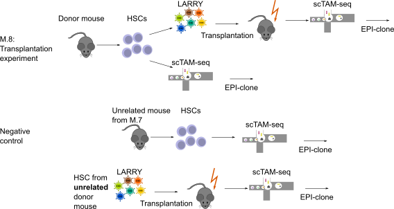

## Experimental design

This vignette highlights the analysis of experiment M.8 of the EPI-Clone manuscript. Here, HSCs were both profiled with scTAM-seq, but also barcoded with LARRY and transplanted into a recipient mouse, which was profiled six months later.



```{r setup, include=FALSE}
knitr::opts_chunk$set(echo = TRUE)
require(ggplot2)
require(ggrepel)
require(RColorBrewer)
require(plotrix)
library(ComplexHeatmap)
library(viridis)
library(corrplot)
plot_theme_legend <- theme(panel.background = element_rect(color='black',fill='white'),
                           panel.grid=element_blank(),
                           text=element_text(color='black',size=8),
                           axis.text=element_text(color='black',size=8),
                           axis.ticks=element_line(color='black', size=.1),
                           strip.background = element_blank(),
                           legend.key=element_rect(color='black', fill=NA),
                           legend.key.size = unit(2, 'mm'),
                           strip.text = element_text(color='black',size=8))
plot_theme <- theme(panel.background = element_rect(color='black',fill='white'),
                    panel.grid=element_blank(),
                    text=element_text(color='black',size=8),
                    axis.text=element_text(color='black',size=8),
                    axis.ticks=element_line(color='black', size=.1),
                    strip.background = element_blank(),
                    legend.position = 'none',
                    strip.text = element_text(color='black',size=8))
cols_chrom <- c('active/weak promoter'='#ff678c',
                'Enhancer'='#ffdc64',
                'transcription'='#008c64',
                'Heterochromatin'='#6e1e8c',
                'weak enhancer'='#ffff00',
                'H3K9me3-repressed'='#787878',
                'Other'='#aaaaaa',
                'H3K9me3-repressed'='#f0f0f0')
celltypeColors <- c("HSC/MPP1"="maroon4",
                    "MPP2" ="darkgrey",
                    "MPP3" = "darkblue",
                    "MPP4" = "darkgreen",
                    "MEP"="#D5392C",
                    "EryP" = "#ED7950",
                    "MkP 1" = "#BDA8CB",
                    "MkP 2" = "#D36494",
                    "GMP" = "#C3C380",
                    "pre/pro-B" ="#94B1F9")
simpleCTmap <- c("pre/pro-B"="lymphoid",
                 "MEP"="erythroid",
                 "EryP"="erythroid",
                 "GMP"="myeloid",
                 "MPP4"="myeloid",
                 "MPP3"=NA,
                 "HSC/MPP1"="immature",
                 "MkP 1"="MkP",
                 "MkP 2"="MkP",
                 "MPP2"="immature")
qual_cols <- brewer.pal.info[brewer.pal.info$category == 'qual',]
cols <- unlist(mapply(brewer.pal, qual_cols$maxcolors, rownames(qual_cols)))
source('../../scripts/helper_functions.R')
source('../../scripts/EPIClone.R')
panel <- read.table('../../infos/panel_info_dropout_pwm.tsv',
                    sep='\t')
```

## Loading

```{r loading}
seurat_old <- readRDS(url('https://figshare.com/ndownloader/files/50835309'))
seurat_old <- subset(seurat_old, Sample=='Old')
seurat_transplant <- readRDS(url('https://figshare.com/ndownloader/files/50835237'))
seurat_transplant$Sample <- 'Transplant'
seurat_obj <- merge(seurat_old, seurat_transplant)
seurat_obj <- JoinLayers(seurat_obj)
```

## EPI-clone

```{r pressure, echo=FALSE}
npcs <- 100
thrbig <- 0.5
static_cpgs <- read.csv('../../infos/cpg_selection.csv',
                        row.names = 1)
static_cpgs <- row.names(static_cpgs[which(static_cpgs$Type=='Static'), ])
epiclone_obj <- epiclone(seurat_obj, plotFolder = '.', tuneParams = F, 
                    npcs.Clustering = npcs, selected.CpGs = static_cpgs, trueClone = NULL, batch = "Sample", protein.assay.name = NULL, 
                    thr.bigCloneSelection = thrbig,npcs.bigCloneSelection = npcs, smoothen.bigCloneSelection = 20, celltype = "CellType",
                    bigClone.relSize = 0.0025, returnIntermediateSeurat = F)
epiclone_old <- epiclone(seurat_old, plotFolder = '.', tuneParams = F, 
                    npcs.Clustering = npcs, selected.CpGs = static_cpgs, trueClone = NULL, batch = "Sample", protein.assay.name = NULL, 
                    thr.bigCloneSelection = thrbig,npcs.bigCloneSelection = npcs, smoothen.bigCloneSelection = 20, celltype = "CellType",
                    bigClone.relSize = 0.0025, returnIntermediateSeurat = F)
```

```{r visualize_results}
epiclone_seurat <- epiclone_obj$finalSeurat
p1 <- DimPlot(epiclone_seurat, reduction = 'cloneUMAP', group.by = c('Sample'))+NoLegend()+NoAxes()
p2 <- DimPlot(epiclone_seurat, reduction = 'cloneUMAP', group.by = c('LARRY'))+NoLegend()+NoAxes()
p1+p2
```

```{r epiclone_results}
DimPlot(epiclone_seurat, reduction = 'cloneUMAP', group.by = c('seurat_clusters'))+NoLegend()+NoAxes()
```

```{r negative_example}
seurat_old_negative <- readRDS(url('https://figshare.com/ndownloader/files/45262060'))
seurat_old_negative <- subset(seurat_old_negative, Sample=='Old')
seurat_transplant <- readRDS(url('https://figshare.com/ndownloader/files/50835237'))
seurat_transplant$Sample <- 'Transplant'
seurat_negative <- merge(seurat_old_negative, seurat_transplant)
seurat_negative <- JoinLayers(seurat_negative)
```

```{r negative_epiclone}
epiclone_negative <- epiclone(seurat_negative, plotFolder = '.', tuneParams = F, 
                    npcs.Clustering = npcs, selected.CpGs = static_cpgs, trueClone = NULL, batch = "Sample", protein.assay.name = NULL, 
                    thr.bigCloneSelection = thrbig,npcs.bigCloneSelection = npcs, smoothen.bigCloneSelection = 20, celltype = "CellType",
                    bigClone.relSize = 0.0025, returnIntermediateSeurat = F)
epiclone_old_negative <- epiclone(seurat_old_negative, plotFolder = '.', tuneParams = F, 
                    npcs.Clustering = npcs, selected.CpGs = static_cpgs, trueClone = NULL, batch = "Sample", protein.assay.name = NULL, 
                    thr.bigCloneSelection = thrbig,npcs.bigCloneSelection = npcs, smoothen.bigCloneSelection = 20, celltype = "CellType",
                    bigClone.relSize = 0.0025, returnIntermediateSeurat = F)
```

```{r visualize_negative_results}
epiclone_negative_seurat <- epiclone_negative$finalSeurat
p1 <- DimPlot(epiclone_seurat, reduction = 'cloneUMAP', cells.highlight = Cells(epiclone_seurat)[epiclone_seurat$CellType%in%'HSC/MPP1'&epiclone_seurat$Sample=='Old'])+NoLegend()+NoAxes()
p2 <-  DimPlot(epiclone_seurat, reduction = 'cloneUMAP', group.by = 'Sample')+NoAxes()
p3 <-  DimPlot(subset(epiclone_seurat, Sample=='Transplant'), reduction = 'cloneUMAP', group.by = 'LARRY')+NoAxes()+NoLegend()
p4 <- DimPlot(epiclone_negative_seurat, reduction = 'cloneUMAP', cells.highlight = Cells(epiclone_negative_seurat)[epiclone_negative_seurat$CellType%in%'HSC/MPP1'&epiclone_negative_seurat$Sample=='Old'])+NoLegend()+NoAxes()
p5 <-  DimPlot(epiclone_negative_seurat, reduction = 'cloneUMAP', group.by = 'Sample')+NoAxes()+NoLegend()
p6 <-  DimPlot(subset(epiclone_negative_seurat, Sample=='Transplant'), reduction = 'cloneUMAP', group.by = 'LARRY')+NoAxes()+NoLegend()
grid.arrange(p1, p2, p3, p4, p5, p6, nrow=2)
```

## Quantify the clones

We will now investigate the number of clones that have:
- at least one HSC from the donor mouse
- at least one cell from the transplant
- a relative clone size larger than 1%

```{r quantify_intersting_clones}
clone_table <- table(epiclone_seurat[[]][, c('seurat_clusters', 'Sample')])
clone_sizes <- rowSums(clone_table)/sum(clone_table)
clone_table_hscs <-  table(subset(epiclone_seurat, CellType=='HSC/MPP1')[[]][, c('seurat_clusters', 'Sample')])
selected_clones <- clone_table[,'Transplant']>0&clone_table_hscs[,'Old']>0
clone_table_negative <- table(epiclone_negative_seurat[[]][, c('seurat_clusters', 'Sample')])
clone_sizes_neative <- rowSums(clone_table_negative)/sum(clone_table_negative)
clone_table_hscs_negative <-  table(subset(epiclone_negative_seurat, CellType=='HSC/MPP1')[[]][, c('seurat_clusters', 'Sample')])
selected_clones_negative <- clone_table_negative[,'Transplant']>0&clone_table_hscs_negative[,'Old']>0
cluster_positive <- clone_table[selected_clones, 'Transplant']/rowSums(clone_table[selected_clones, ])
cluster_negative <- clone_table_negative[selected_clones_negative, 'Transplant']/rowSums(clone_table_negative[selected_clones_negative, ])
to_plot <- data.frame(Sample=c(rep('Positive', length(cluster_positive)), rep('Negative', length(cluster_negative))), Overlap=c(cluster_positive, cluster_negative))
ggplot(to_plot, aes(x=Sample, y=Overlap))+geom_violin()+plot_theme_legend
```


```{r select_clones}
clone_table <- table(epiclone_seurat[[]][, c('seurat_clusters', 'Sample')])
clone_sizes_transplant <- clone_table[, 'Transplant']/sum(clone_table[, 'Transplant'])
clone_table_negative <- table(epiclone_negative_seurat[[]][, c('seurat_clusters', 'Sample')])
clone_sizes_negative_transplant <- clone_table_negative[, 'Transplant']/sum(clone_table_negative[, 'Transplant'])
clone_table_hscs <-  table(subset(epiclone_seurat, CellType=='HSC/MPP1')[[]][, c('seurat_clusters', 'Sample')])
selected_clones <- sum(clone_table_hscs[,'Old']>0&clone_sizes_transplant>0.01)/sum(clone_sizes_transplant>0.01)
selected_clones_negative <- sum(clone_table_hscs_negative[,'Old']>0&clone_sizes_negative_transplant>0.01)/sum(clone_sizes_negative_transplant>0.01)
to_plot <- data.frame(Sample=c('Positive', 'Negative'), Overlap=c(selected_clones, selected_clones_negative))
ggplot(to_plot, aes(x=Sample, y=Overlap))+geom_histogram(stat='identity')+plot_theme_legend+ylab('Percentage of expanded EPI-clones with donor HSC')
```


## Quantify cells

Now we count the cells from the Transplant that are part of these selected clones, i.e., that originate from this transplanted HSC.

```{r quantify_cells}
selected_clones <- clone_table_hscs[,'Old']>0&clone_sizes_transplant>0.01
selected_clones_negative <- clone_table_hscs_negative[,'Old']>0&clone_sizes_negative_transplant>0.01
sum_positive <- sum(subset(epiclone_seurat, Sample=='Transplant')$seurat_clusters%in%names(selected_clones)[selected_clones])/length(Cells(subset(epiclone_seurat, Sample=='Transplant')))
sum_negative <- sum(subset(epiclone_negative_seurat, Sample=='Transplant')$seurat_clusters%in%names(selected_clones_negative)[selected_clones_negative])/length(Cells(subset(epiclone_negative_seurat, Sample=='Transplant')))
to_plot <- data.frame(Sample=c('Positive', 'Negative'), Perc=c(sum_positive, sum_negative))
ggplot(to_plot, aes(x=Sample, y=Perc))+geom_histogram(stat='identity')+plot_theme_legend+ylab('Percentage of cells of potential transplant origin')
```


```{r quantify_expanded_non_expanded}
is_expanded_positive <- Cells(epiclone_old$finalSeurat)
is_expanded_negative <- Cells(epiclone_old_negative$finalSeurat)
expanded_clones_positive <- Cells(epiclone_obj$finalSeurat)
expanded_clones_negative <- Cells(epiclone_negative$finalSeurat)
table_positve <- data.frame(Cell=Cells(seurat_obj),
      ExpandedBefore=ifelse(Cells(seurat_obj)%in%is_expanded_positive, 'Expanded', 'Small'), 
      ExpandedAfter=ifelse(Cells(seurat_obj)%in%expanded_clones_positive, 'Expanded', 'Small'))
table_negative <- data.frame(Cell=Cells(seurat_negative),
      ExpandedBefore=ifelse(Cells(seurat_negative)%in%is_expanded_negative, 'Expanded', 'Small'), 
      ExpandedAfter=ifelse(Cells(seurat_negative)%in%expanded_clones_negative, 'Expanded', 'Small'))
table(table_positve[, 2:3])
```

```{r other}
table(table_negative[, 2:3])
```

## How many clusters have both red and blue dots?

```{r compare}
positive_overlaps <- sapply(unique(epiclone_obj$finalSeurat$seurat_clusters), function(x){
  length(unique(epiclone_obj$finalSeurat$Sample[epiclone_obj$finalSeurat$seurat_clusters==x]))>1
})
negative_overlaps <- sapply(unique(epiclone_negative$finalSeurat$seurat_clusters), function(x){
  length(unique(epiclone_negative$finalSeurat$Sample[epiclone_negative$finalSeurat$seurat_clusters==x]))>1
})
```

## Look only at HSCs

```{r hscs_positive}
p1 <- DimPlot(epiclone_seurat, reduction = 'cloneUMAP', split.by = c('Sample'), cells.highlight = Cells(epiclone_seurat)[epiclone_seurat$CellType%in%'HSC/MPP1'])+NoLegend()+NoAxes()
p2 <- DimPlot(subset(epiclone_seurat, CellType=='HSC/MPP1'), reduction = 'cloneUMAP', group.by = c('Sample'))+NoAxes()
p1+p2
```

```{r hsc_negative}
p1 <- DimPlot(epiclone_negative_seurat, reduction = 'cloneUMAP', group.by = c('Sample'))+NoLegend()+NoAxes()
p2 <- DimPlot(subset(epiclone_negative_seurat, CellType=='HSC/MPP1'), reduction = 'cloneUMAP', group.by = c('Sample'))+NoLegend()+NoAxes()
p1+p2
```

```{r quantify}
res_positive <- table(epiclone_seurat[[]][, c('seurat_clusters', 'Sample')])
cluster_positive <- res_positive[, 'Transplant']/rowSums(res_positive)
res_negative <- table(epiclone_negative_seurat[[]][, c('seurat_clusters', 'Sample')])
cluster_negative <- res_negative[, 'Transplant']/rowSums(res_negative)
to_plot <- data.frame(Sample=c(rep('Positive', length(cluster_positive)), rep('Negative', length(cluster_negative))), Overlap=c(cluster_positive, cluster_negative))
ggplot(to_plot, aes(x=Sample, y=Overlap))+geom_violin()+plot_theme_legend
wilcox.test(cluster_negative, cluster_positive)
```

```{r compare_clone_sizes}
clone_sizes_old <- table(epiclone_seurat$seurat_clusters[epiclone_seurat$Sample=='Old'])
clone_sizes_transplant <- table(epiclone_seurat$seurat_clusters[epiclone_seurat$Sample=='Transplant'])
to_plot <- data.frame(Old=as.data.frame(clone_sizes_old)$Freq, Transplant=as.data.frame(clone_sizes_transplant)$Freq)
to_plot <- to_plot[apply(to_plot,1,min)>0,]
ggplot(to_plot, aes(x=Old, y=Transplant))+geom_point()+geom_smooth(method='lm', se=FALSE)+plot_theme
```


```{r umaps_again}
p1 <- DimPlot(epiclone_negative_seurat, reduction = 'cloneUMAP', group.by = c('Sample'))+NoLegend()+NoAxes()
p2 <- DimPlot(subset(epiclone_negative_seurat, seurat_clusters%in%names(selected_clones_negative)[selected_clones_negative]), reduction = 'cloneUMAP', group.by = c('Sample'))+NoLegend()+NoAxes()
p1+p2
```

```{r more_umaps}
p1 <- DimPlot(epiclone_seurat, reduction = 'cloneUMAP', group.by = c('Sample'))+NoAxes()
p2 <- DimPlot(subset(epiclone_seurat, seurat_clusters%in%names(selected_clones)[selected_clones]), reduction = 'cloneUMAP', group.by = c('Sample'))+NoLegend()+NoAxes()
p1+p2
```

## Clonal output heatmaps

```{r clonal_output}
simpleCTmap <- c("pre/pro-B"="lymphoid",
                 "MEP"="erythroid",
                 "EryP"="erythroid",
                 "GMP"="myeloid",
                 "MPP4"="myeloid",
                 "MPP3"=NA,
                 "HSC/MPP1"="immature",
                 "MkP 1"="MkP",
                 "MkP 2"="MkP",
                 "MPP2"="immature")
clones <- Idents(epiclone_seurat)
clone_counts <- na.omit(plyr::count(clones))
rowinfo <- data.frame(CellType=epiclone_seurat$CellType, Clone=clones, Sample=epiclone_seurat$Sample)
rowinfo$CloneCount <- NA
for(i in 1:nrow(clone_counts)){
  for(s in unique(rowinfo$Sample)){
    rowinfo[(rowinfo$Clone%in%clone_counts$x[i])&rowinfo$Sample==s, 'CloneCount'] <- clone_counts$freq[i]
  }
}
rowinfo$SimpleCellType <- simpleCTmap[as.character(rowinfo$CellType)]
frequencies_donor <- as.data.frame(matrix(NA, nrow = length(clone_counts$x), ncol = length(na.omit(unique(rowinfo$SimpleCellType)))))
row.names(frequencies_donor) <- clone_counts$x
colnames(frequencies_donor) <- na.omit(unique(rowinfo$SimpleCellType))
frequencies_transplant <- as.data.frame(matrix(NA, nrow = length(clone_counts$x), ncol = length(na.omit(unique(rowinfo$SimpleCellType)))))
row.names(frequencies_transplant) <- clone_counts$x
colnames(frequencies_transplant) <- na.omit(unique(rowinfo$SimpleCellType))

rowinfo <- rowinfo[!is.na(rowinfo$SimpleCellType), ]
for(x in clone_counts$x){
  counts <- plyr::count(rowinfo[(rowinfo$Clone%in%x)&rowinfo$Sample=='Old', 'SimpleCellType'])
  frequencies_donor[x, counts$x] <- counts$freq
}
for(x in clone_counts$x){
  counts <- plyr::count(rowinfo[(rowinfo$Clone%in%x)&rowinfo$Sample=='Transplant', 'SimpleCellType'])
  frequencies_transplant[x, counts$x] <- counts$freq
}
frequencies_transplant[is.na(frequencies_transplant)] <- 0
frequencies_transplant <- frequencies_transplant[, c('immature', 'erythroid', 'myeloid', 'lymphoid')]
frequencies_transplant <- apply(frequencies_transplant, 2, function(x)x/sum(x))
frequencies_transplant <- frequencies_transplant/rowSums(frequencies_transplant)
frequencies_donor[is.na(frequencies_donor)] <- 0
frequencies_donor <- frequencies_donor[, c('immature', 'erythroid', 'myeloid', 'lymphoid')]
frequencies_donor <- apply(frequencies_donor, 2, function(x)x/sum(x))
frequencies_donor <- frequencies_donor/rowSums(frequencies_donor)

col_anno_fr <- data.frame(Sample=c(rep('Donor', 4), rep('Transplant', 4)))
col_anno <- HeatmapAnnotation(df=col_anno_fr,
                              show_legend = FALSE,
                              show_annotation_name = FALSE,
                              col=list(Sample=c('Donor'='#F8766D',
                                                'Transplant'='#00BFC4')),
                              height=unit(3, 'mm'))
c_donor <- paste0(colnames(frequencies_donor), '_Donor')
colnames(frequencies_donor) <- c_donor
c_transplant <- paste0(colnames(frequencies_transplant), '_Transplant')
colnames(frequencies_transplant) <-c_transplant
frequencies <- data.frame(frequencies_donor, frequencies_transplant)
hm <- ComplexHeatmap::Heatmap(na.omit(frequencies[, c(c_donor, c_transplant)]),
                              show_row_names = FALSE,
                              col = viridis(50),
                              cluster_rows = TRUE,
                              cluster_columns = FALSE,
                              clustering_distance_rows = 'euclidean',
                              clustering_method_rows = 'ward.D2',
                              show_heatmap_legend =FALSE,
                              #top_annotation = col_anno,
                              column_names_gp = grid::gpar(fontsize = 8),
                              column_split = col_anno_fr$Sample,
                              column_title_gp = gpar(fontsize = 8))
draw(hm)
```
